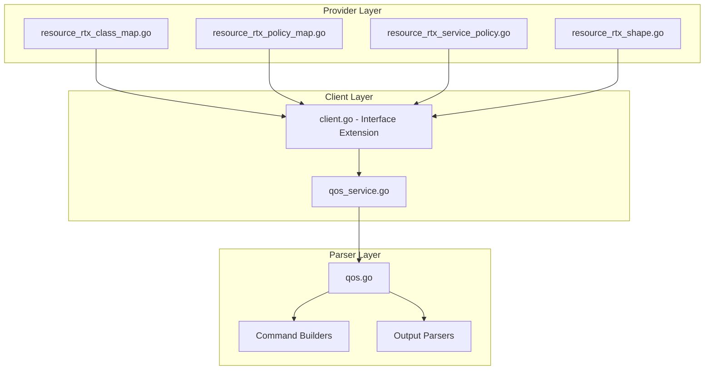

# Design Document: rtx_qos

## Overview

The QoS resources enable Terraform-based management of QoS (Quality of Service) and traffic shaping on Yamaha RTX series routers. Following Cisco MQC (Modular QoS CLI) naming patterns, this specification covers four separate resources:

- **`rtx_class_map`**: Traffic classification rules
- **`rtx_policy_map`**: QoS policy definition with class actions
- **`rtx_service_policy`**: Apply policy to interface
- **`rtx_shape`**: Traffic shaping configuration

## Code Reuse Analysis

### Existing Components to Leverage

- **`internal/client/dhcp_scope_service.go`**: Pattern for service layer implementation with CRUD operations.
- **`internal/client/interfaces.go`**: Extend the `Client` interface with QoS methods.
- **`internal/rtx/parsers/dhcp_scope.go`**: Reference for parser implementation and command builders.
- **`internal/provider/resource_rtx_dhcp_scope.go`**: Template for Terraform resource structure.

### Integration Points

- **`rtxClient`**: Add QoS methods for CRUD operations
- **`Executor`**: Use existing SSH command execution infrastructure
- **Interface configuration**: Coordinate with interface settings

## Architecture



### Modular Design Principles

- **Single File Responsibility**: `QoSService` handles all QoS CRUD operations
- **Component Isolation**: Parser, service, and resource layers clearly separated
- **Service Layer Separation**: Service encapsulates all QoS logic
- **Utility Modularity**: Shared validation functions for bandwidth/class operations

## Components and Interfaces

### Component 1: QoSService (`internal/client/qos_service.go`)

- **Purpose:** Handles all QoS CRUD operations against the RTX router
- **Interfaces:**
  ```go
  type QoSService struct {
      executor Executor
      client   *rtxClient
  }

  func (s *QoSService) Create(ctx context.Context, qos QoSConfig) error
  func (s *QoSService) Get(ctx context.Context, iface string) (*QoSConfig, error)
  func (s *QoSService) Update(ctx context.Context, qos QoSConfig) error
  func (s *QoSService) Delete(ctx context.Context, iface string) error
  func (s *QoSService) List(ctx context.Context) ([]QoSConfig, error)
  ```
- **Dependencies:** `Executor`, `rtxClient`, `parsers.QoSParser`
- **Reuses:** Pattern from service layer implementations

### Component 2: QoSParser (`internal/rtx/parsers/qos.go`)

- **Purpose:** Parses RTX router output for QoS configuration and builds commands
- **Interfaces:**
  ```go
  type QoSConfig struct {
      Interface     string        `json:"interface"`
      QueueType     string        `json:"queue_type"`  // priority, cbq, etc.
      Classes       []QoSClass    `json:"classes"`
      ShapeAverage  int           `json:"shape_average,omitempty"`
      ShapeBurst    int           `json:"shape_burst,omitempty"`
  }

  type QoSClass struct {
      Name             string `json:"name"`
      Filter           int    `json:"filter,omitempty"`
      Priority         string `json:"priority,omitempty"`
      BandwidthPercent int    `json:"bandwidth_percent,omitempty"`
      PoliceCIR        int    `json:"police_cir,omitempty"`
      QueueLimit       int    `json:"queue_limit,omitempty"`
  }

  func ParseQoSConfig(raw string) ([]QoSConfig, error)
  func BuildQueueTypeCommand(iface, qType string) string
  func BuildQueueClassFilterCommand(iface string, class QoSClass) string
  func BuildQueueClassPriorityCommand(iface, className, priority string) string
  func BuildSpeedCommand(iface string, bandwidth int) string
  func BuildQueueLengthCommand(iface, className string, length int) string
  func BuildDeleteQoSCommand(iface string) string
  ```
- **Dependencies:** `regexp`, `strings`, `strconv`
- **Reuses:** Bandwidth validation patterns

### Component 3: Terraform Resources

#### 3.1 ClassMap Resource (`internal/provider/resource_rtx_class_map.go`)

```go
func resourceRTXClassMap() *schema.Resource
func resourceRTXClassMapCreate(ctx, d, meta) diag.Diagnostics
func resourceRTXClassMapRead(ctx, d, meta) diag.Diagnostics
func resourceRTXClassMapUpdate(ctx, d, meta) diag.Diagnostics
func resourceRTXClassMapDelete(ctx, d, meta) diag.Diagnostics
func resourceRTXClassMapImport(ctx, d, meta) ([]*schema.ResourceData, error)
```

#### 3.2 PolicyMap Resource (`internal/provider/resource_rtx_policy_map.go`)

```go
func resourceRTXPolicyMap() *schema.Resource
func resourceRTXPolicyMapCreate(ctx, d, meta) diag.Diagnostics
func resourceRTXPolicyMapRead(ctx, d, meta) diag.Diagnostics
func resourceRTXPolicyMapUpdate(ctx, d, meta) diag.Diagnostics
func resourceRTXPolicyMapDelete(ctx, d, meta) diag.Diagnostics
func resourceRTXPolicyMapImport(ctx, d, meta) ([]*schema.ResourceData, error)
```

#### 3.3 ServicePolicy Resource (`internal/provider/resource_rtx_service_policy.go`)

```go
func resourceRTXServicePolicy() *schema.Resource
func resourceRTXServicePolicyCreate(ctx, d, meta) diag.Diagnostics
func resourceRTXServicePolicyRead(ctx, d, meta) diag.Diagnostics
func resourceRTXServicePolicyUpdate(ctx, d, meta) diag.Diagnostics
func resourceRTXServicePolicyDelete(ctx, d, meta) diag.Diagnostics
func resourceRTXServicePolicyImport(ctx, d, meta) ([]*schema.ResourceData, error)
```

#### 3.4 Shape Resource (`internal/provider/resource_rtx_shape.go`)

```go
func resourceRTXShape() *schema.Resource
func resourceRTXShapeCreate(ctx, d, meta) diag.Diagnostics
func resourceRTXShapeRead(ctx, d, meta) diag.Diagnostics
func resourceRTXShapeUpdate(ctx, d, meta) diag.Diagnostics
func resourceRTXShapeDelete(ctx, d, meta) diag.Diagnostics
func resourceRTXShapeImport(ctx, d, meta) ([]*schema.ResourceData, error)
```

- **Dependencies:** `Client`, `QoSConfig`, Terraform SDK
- **Reuses:** Resource patterns from other implementations

### Component 4: Client Interface Extension (`internal/client/interfaces.go`)

- **Purpose:** Extend Client interface with QoS methods
- **Interfaces:**
  ```go
  // Add to existing Client interface:
  GetQoS(ctx context.Context, iface string) (*QoSConfig, error)
  CreateQoS(ctx context.Context, qos QoSConfig) error
  UpdateQoS(ctx context.Context, qos QoSConfig) error
  DeleteQoS(ctx context.Context, iface string) error
  ListQoS(ctx context.Context) ([]QoSConfig, error)
  ```
- **Dependencies:** Existing Client interface
- **Reuses:** Pattern from existing methods

## Data Models

### QoSConfig

```go
// QoSConfig represents QoS configuration on an RTX router interface
type QoSConfig struct {
    Interface    string     `json:"interface"`     // Interface name
    QueueType    string     `json:"queue_type"`    // priority, cbq, etc.
    Classes      []QoSClass `json:"classes"`       // Traffic classes
    ShapeAverage int        `json:"shape_average"` // Average rate bps
    ShapeBurst   int        `json:"shape_burst"`   // Burst size bps
}

// QoSClass represents a traffic class in QoS policy
type QoSClass struct {
    Name             string `json:"name"`              // Class name
    Filter           int    `json:"filter,omitempty"`  // IP filter number
    Priority         string `json:"priority"`          // high/medium/normal/low
    BandwidthPercent int    `json:"bandwidth_percent"` // % of interface bandwidth
    PoliceCIR        int    `json:"police_cir"`        // Committed rate bps
    QueueLimit       int    `json:"queue_limit"`       // Queue depth
}
```

### Terraform Schema

```hcl
# Class map - define traffic classification
resource "rtx_class_map" "voip" {
  name = "VOIP"

  match_protocol         = "udp"
  match_destination_port = ["5060", "10000-20000"]
}

resource "rtx_class_map" "web" {
  name = "WEB"

  match_protocol         = "tcp"
  match_destination_port = ["80", "443"]
}

# Policy map - define QoS policy
resource "rtx_policy_map" "wan_qos" {
  name = "WAN_QOS"

  class {
    name     = "VOIP"
    priority = true
    police_cir = 1000000  # 1 Mbps
  }

  class {
    name              = "WEB"
    bandwidth_percent = 30
  }

  class {
    name              = "class-default"
    bandwidth_percent = 20
    queue_limit       = 64
  }
}

# Apply policy to interface
resource "rtx_service_policy" "wan" {
  interface  = "pp1"
  direction  = "output"
  policy_map = "WAN_QOS"
}

# Traffic shaping
resource "rtx_shape" "upload_limit" {
  interface     = "lan1"
  direction     = "output"
  shape_average = 50000000  # 50 Mbps
  shape_burst   = 1000000   # 1 Mbps burst
}
```

## RTX Command Mapping

### Configure Queue Type

```
queue <interface> type priority
queue <interface> type cbq
```

### Configure Class Filter

```
queue <interface> class filter <n> <filter>
```

Example: `queue pp1 class filter 1 100`

### Configure Class Priority

```
queue <interface> class priority <class> <priority>
```

Example: `queue pp1 class priority 1 high`

### Configure Interface Speed/Shaping

```
speed <interface> <bandwidth>
```

Example: `speed pp1 50m`

### Configure Queue Length

```
queue <interface> length <class> <length>
```

### Delete QoS Configuration

```
no queue <interface>
```

### Show Configuration

```
show config | grep queue
show queue <interface>
```

## Error Handling

### Error Scenarios

1. **Invalid Interface**
   - **Handling:** Validate interface exists
   - **User Impact:** Clear error indicating invalid interface

2. **Invalid Queue Type**
   - **Handling:** Validate queue type is supported
   - **User Impact:** Error with valid types

3. **Invalid Priority**
   - **Handling:** Validate priority is high/medium/normal/low
   - **User Impact:** Clear error with valid values

4. **Invalid Bandwidth**
   - **Handling:** Validate bandwidth is positive integer
   - **User Impact:** Clear error with expected format

5. **Bandwidth Sum Exceeds 100%**
   - **Handling:** Validate class bandwidth doesn't exceed 100%
   - **User Impact:** Clear validation error

6. **Connection/Command Timeout**
   - **Handling:** Use existing retry logic from `rtxClient`
   - **User Impact:** Standard Terraform timeout error

## Testing Strategy

### Unit Testing

- **Parser Tests** (`qos_test.go`):
  - Parse various RTX `show config` output for QoS
  - Test command builder functions with different parameters
  - Test bandwidth calculations

- **Service Tests** (`qos_service_test.go`):
  - Mock executor for service method testing
  - Test error handling for various failure scenarios
  - Test class configuration

### Integration Testing

- **Resource Tests**:
  - `resource_rtx_class_map_test.go`
  - `resource_rtx_policy_map_test.go`
  - `resource_rtx_service_policy_test.go`
  - `resource_rtx_shape_test.go`
  - Full CRUD lifecycle with mock client
  - Import functionality testing
  - Multi-class configuration testing

### End-to-End Testing

- **Acceptance Tests** (with real RTX router):
  - Create QoS with priority queuing
  - Configure traffic shaping
  - Update class settings
  - Delete QoS configuration
  - Import existing QoS

## File Structure

```
internal/
├── provider/
│   ├── resource_rtx_class_map.go         # NEW: Class map resource
│   ├── resource_rtx_class_map_test.go    # NEW: Class map tests
│   ├── resource_rtx_policy_map.go        # NEW: Policy map resource
│   ├── resource_rtx_policy_map_test.go   # NEW: Policy map tests
│   ├── resource_rtx_service_policy.go    # NEW: Service policy resource
│   ├── resource_rtx_service_policy_test.go # NEW: Service policy tests
│   ├── resource_rtx_shape.go             # NEW: Shape resource
│   └── resource_rtx_shape_test.go        # NEW: Shape tests
├── client/
│   ├── interfaces.go             # MODIFY: Add QoS types and methods
│   ├── client.go                 # MODIFY: Add QoS service initialization
│   ├── qos_service.go           # NEW: QoS service implementation
│   └── qos_service_test.go      # NEW: Service tests
└── rtx/
    └── parsers/
        ├── qos.go               # NEW: Parser and command builders
        └── qos_test.go          # NEW: Parser tests
```

## Implementation Notes

1. **Per-Interface Resource**: QoS is configured per interface. Terraform ID is the interface name.

2. **Class Map vs Policy Map**: Consider whether to implement as separate resources or combined (RTX style).

3. **Bandwidth Units**: RTX accepts m (mega), k (kilo), etc. suffixes. Normalize in parsing.

4. **Filter Association**: Classes are associated with IP filters for classification.

5. **Priority Queuing**: Four priority levels - high, medium, normal, low.

6. **Shaping vs Policing**: Shaping smooths traffic; policing drops excess. Consider as separate attributes.

7. **ForceNew**: Interface is ForceNew. Other attributes support in-place updates.

8. **Dependency**: Classes depend on IP filters being configured first.

9. **Configuration Save**: Use existing `SaveConfig()` pattern after modifications.

10. **Provider Registration**: Add `resourceRTXClassMap`, `resourceRTXPolicyMap`, `resourceRTXServicePolicy`, and `resourceRTXShape` to provider's resource map.

11. **Resource Dependencies**: service_policy depends on policy_map, which depends on class_map.

## State Handling

- Persist only configuration attributes in Terraform state.
- Operational/runtime status must not be stored in state to avoid perpetual diffs.
