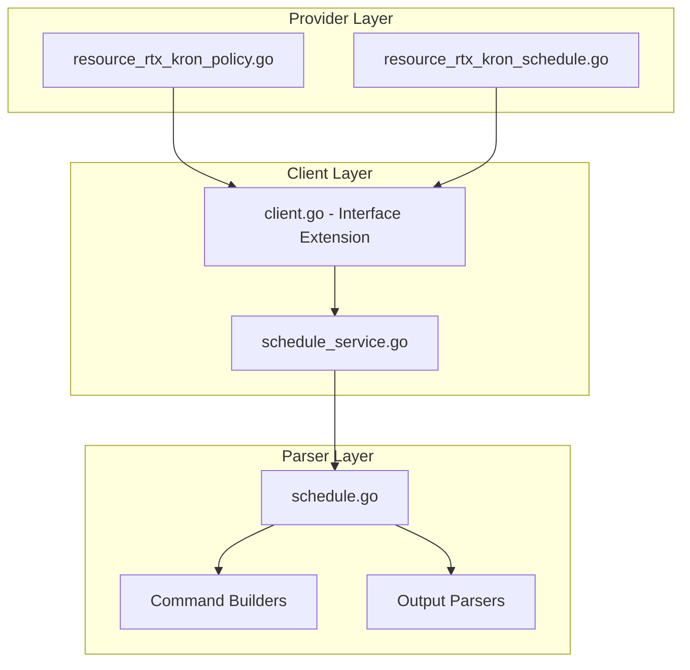

# Design Document: rtx_schedule

## Overview

The schedule resources enable Terraform-based management of scheduled tasks and time-based automation on Yamaha RTX series routers. Following Cisco Kron scheduler naming patterns, this specification covers two resources:

- **`rtx_kron_policy`**: Command list definition (what commands to run)
- **`rtx_kron_schedule`**: Schedule definition (when to run)

## Code Reuse Analysis

### Existing Components to Leverage

- **`internal/client/dhcp_scope_service.go`**: Pattern for service layer implementation with CRUD operations.
- **`internal/client/interfaces.go`**: Extend the `Client` interface with schedule methods.
- **`internal/rtx/parsers/dhcp_scope.go`**: Reference for parser implementation and command builders.
- **`internal/provider/resource_rtx_dhcp_scope.go`**: Template for Terraform resource structure.

### Integration Points

- **`rtxClient`**: Add schedule methods for CRUD operations
- **`Executor`**: Use existing SSH command execution infrastructure

## Architecture



### Modular Design Principles

- **Single File Responsibility**: `ScheduleService` handles all schedule CRUD operations
- **Component Isolation**: Parser, service, and resource layers clearly separated
- **Service Layer Separation**: Service encapsulates all schedule logic
- **Utility Modularity**: Shared validation functions for time/date operations

## Components and Interfaces

### Component 1: ScheduleService (`internal/client/schedule_service.go`)

- **Purpose:** Handles all schedule CRUD operations against the RTX router
- **Interfaces:**
  ```go
  type ScheduleService struct {
      executor Executor
      client   *rtxClient
  }

  func (s *ScheduleService) Create(ctx context.Context, schedule Schedule) error
  func (s *ScheduleService) Get(ctx context.Context, scheduleID int) (*Schedule, error)
  func (s *ScheduleService) Update(ctx context.Context, schedule Schedule) error
  func (s *ScheduleService) Delete(ctx context.Context, scheduleID int) error
  func (s *ScheduleService) List(ctx context.Context) ([]Schedule, error)
  ```
- **Dependencies:** `Executor`, `rtxClient`, `parsers.ScheduleParser`
- **Reuses:** Pattern from service layer implementations

### Component 2: ScheduleParser (`internal/rtx/parsers/schedule.go`)

- **Purpose:** Parses RTX router output for schedule configuration and builds commands
- **Interfaces:**
  ```go
  type Schedule struct {
      ID          int      `json:"id"`
      Name        string   `json:"name,omitempty"`
      AtTime      string   `json:"at_time,omitempty"`
      DayOfWeek   string   `json:"day_of_week,omitempty"`
      Date        string   `json:"date,omitempty"`
      Recurring   bool     `json:"recurring"`
      OnStartup   bool     `json:"on_startup"`
      PolicyList  string   `json:"policy_list,omitempty"`
      Commands    []string `json:"commands,omitempty"`
      Enabled     bool     `json:"enabled"`
  }

  func ParseScheduleConfig(raw string) ([]Schedule, error)
  func BuildScheduleAtCommand(id int, time, command string) string
  func BuildScheduleAtStartupCommand(id int, command string) string
  func BuildScheduleAtDateTimeCommand(id int, date, time, command string) string
  func BuildSchedulePPCommand(ppNum int, day, time, action string) string
  func BuildDeleteScheduleCommand(id int) string
  ```
- **Dependencies:** `regexp`, `strings`, `strconv`, `time`
- **Reuses:** Time/date validation patterns

### Component 3: Terraform Resources

#### 3.1 KronPolicy Resource (`internal/provider/resource_rtx_kron_policy.go`)

```go
func resourceRTXKronPolicy() *schema.Resource
func resourceRTXKronPolicyCreate(ctx, d, meta) diag.Diagnostics
func resourceRTXKronPolicyRead(ctx, d, meta) diag.Diagnostics
func resourceRTXKronPolicyUpdate(ctx, d, meta) diag.Diagnostics
func resourceRTXKronPolicyDelete(ctx, d, meta) diag.Diagnostics
func resourceRTXKronPolicyImport(ctx, d, meta) ([]*schema.ResourceData, error)
```

#### 3.2 KronSchedule Resource (`internal/provider/resource_rtx_kron_schedule.go`)

```go
func resourceRTXKronSchedule() *schema.Resource
func resourceRTXKronScheduleCreate(ctx, d, meta) diag.Diagnostics
func resourceRTXKronScheduleRead(ctx, d, meta) diag.Diagnostics
func resourceRTXKronScheduleUpdate(ctx, d, meta) diag.Diagnostics
func resourceRTXKronScheduleDelete(ctx, d, meta) diag.Diagnostics
func resourceRTXKronScheduleImport(ctx, d, meta) ([]*schema.ResourceData, error)
```

- **Dependencies:** `Client`, `Schedule`, Terraform SDK
- **Reuses:** Resource patterns from other implementations

### Component 4: Client Interface Extension (`internal/client/interfaces.go`)

- **Purpose:** Extend Client interface with schedule methods
- **Interfaces:**
  ```go
  // Add to existing Client interface:
  GetSchedule(ctx context.Context, scheduleID int) (*Schedule, error)
  CreateSchedule(ctx context.Context, schedule Schedule) error
  UpdateSchedule(ctx context.Context, schedule Schedule) error
  DeleteSchedule(ctx context.Context, scheduleID int) error
  ListSchedules(ctx context.Context) ([]Schedule, error)
  ```
- **Dependencies:** Existing Client interface
- **Reuses:** Pattern from existing methods

## Data Models

### Schedule

```go
// Schedule represents a scheduled task on an RTX router
type Schedule struct {
    ID         int      `json:"id"`                    // Schedule ID
    Name       string   `json:"name,omitempty"`        // Description
    AtTime     string   `json:"at_time,omitempty"`     // Time (HH:MM format)
    DayOfWeek  string   `json:"day_of_week,omitempty"` // monday, tuesday, etc.
    Date       string   `json:"date,omitempty"`        // Date (YYYY/MM/DD format)
    Recurring  bool     `json:"recurring"`             // Recurring schedule
    OnStartup  bool     `json:"on_startup"`            // Execute on startup
    PolicyList string   `json:"policy_list,omitempty"` // Associated policy name
    Commands   []string `json:"commands,omitempty"`    // Commands to execute
    Enabled    bool     `json:"enabled"`               // Schedule enabled
}
```

### Terraform Schema

```hcl
# Kron policy (command list)
resource "rtx_kron_policy" "backup_commands" {
  name = "BACKUP_POLICY"

  command_lines = [
    "copy config sd1:backup/config-$(date +%Y%m%d).txt"
  ]
}

# Daily recurring schedule
resource "rtx_kron_schedule" "daily_backup" {
  id   = 1
  name = "DAILY_BACKUP"

  at_time   = "02:00"
  recurring = true

  policy_list = "BACKUP_POLICY"
}

# Weekly recurring schedule
resource "rtx_kron_schedule" "weekly_reboot" {
  id   = 2
  name = "WEEKLY_REBOOT"

  at_time     = "04:00"
  day_of_week = "sunday"
  recurring   = true

  policy_list = "REBOOT_POLICY"
}

resource "rtx_kron_policy" "reboot_commands" {
  name = "REBOOT_POLICY"

  command_lines = ["restart"]
}

# Startup schedule
resource "rtx_kron_schedule" "startup_task" {
  id   = 3
  name = "STARTUP_LOG"

  on_startup = true

  policy_list = "STARTUP_POLICY"
}

resource "rtx_kron_policy" "startup_commands" {
  name = "STARTUP_POLICY"

  command_lines = [
    "syslog info 'Router started successfully'"
  ]
}

# One-time schedule
resource "rtx_kron_schedule" "maintenance" {
  id   = 4
  name = "MAINTENANCE_WINDOW"

  date      = "2026/01/25"
  at_time   = "03:00"
  recurring = false

  policy_list = "MAINTENANCE_POLICY"
}
```

## RTX Command Mapping

### Create Scheduled Task

```
schedule at <id> <time> <command>
```

Example: `schedule at 1 02:00 copy config sd1:backup.txt`

### Create Startup Task

```
schedule at <id> startup <command>
```

Example: `schedule at 2 startup syslog info "Router started"`

### Create Date-Specific Task

```
schedule at <id> <date> <time> <command>
```

Example: `schedule at 3 2026/01/25 03:00 restart`

### Create PP Schedule (Connection Control)

```
schedule pp <n> <day> <time> connect
schedule pp <n> <day> <time> disconnect
```

Example: `schedule pp 1 mon-fri 08:00 connect`

### Delete Schedule

```
no schedule at <id>
```

### Show Configuration

```
show config | grep schedule
show schedule
```

## Error Handling

### Error Scenarios

1. **Invalid Schedule ID**
   - **Handling:** Validate ID is positive integer
   - **User Impact:** Clear validation error

2. **Invalid Time Format**
   - **Handling:** Validate HH:MM format
   - **User Impact:** Error with expected format

3. **Invalid Date Format**
   - **Handling:** Validate YYYY/MM/DD format
   - **User Impact:** Error with expected format

4. **Invalid Day of Week**
   - **Handling:** Validate day name
   - **User Impact:** Error with valid day names

5. **Duplicate Schedule ID**
   - **Handling:** Check for existing schedule
   - **User Impact:** Error suggesting different ID

6. **Connection/Command Timeout**
   - **Handling:** Use existing retry logic from `rtxClient`
   - **User Impact:** Standard Terraform timeout error

## Testing Strategy

### Unit Testing

- **Parser Tests** (`schedule_test.go`):
  - Parse various RTX `show config` output for schedules
  - Test command builder functions with different parameters
  - Test time/date parsing

- **Service Tests** (`schedule_service_test.go`):
  - Mock executor for service method testing
  - Test error handling for various failure scenarios
  - Test recurring vs one-time schedules

### Integration Testing

- **Resource Tests**:
  - `resource_rtx_kron_policy_test.go`
  - `resource_rtx_kron_schedule_test.go`
  - Full CRUD lifecycle with mock client
  - Import functionality testing
  - Startup schedule testing

### End-to-End Testing

- **Acceptance Tests** (with real RTX router):
  - Create daily recurring schedule
  - Create startup schedule
  - Create one-time schedule
  - Update schedule time
  - Delete schedule
  - Import existing schedule

## State Handling

- Persist only configuration attributes in Terraform state.
- Runtime status used for conditional execution is operational-only and must not be stored in state.

## File Structure

```
internal/
├── provider/
│   ├── resource_rtx_kron_policy.go       # NEW: Policy resource
│   ├── resource_rtx_kron_policy_test.go  # NEW: Policy tests
│   ├── resource_rtx_kron_schedule.go     # NEW: Schedule resource
│   └── resource_rtx_kron_schedule_test.go # NEW: Schedule tests
├── client/
│   ├── interfaces.go                  # MODIFY: Add Schedule types and methods
│   ├── client.go                      # MODIFY: Add schedule service initialization
│   ├── schedule_service.go           # NEW: Schedule service implementation
│   └── schedule_service_test.go      # NEW: Service tests
└── rtx/
    └── parsers/
        ├── schedule.go               # NEW: Parser and command builders
        └── schedule_test.go          # NEW: Parser tests
```

## Implementation Notes

1. **Terraform ID**: Use schedule ID as Terraform resource ID.

2. **ForceNew**: Schedule ID is ForceNew. Other attributes support in-place updates.

3. **Policy vs Command**: RTX uses direct commands in schedules. Consider kron_policy as Cisco-compatible wrapper or direct command_lines attribute.

4. **Time Format**: RTX uses HH:MM format. Validate and parse accordingly.

5. **Day of Week**: RTX supports individual days and ranges (mon-fri).

6. **Timezone**: Schedules use router's configured timezone.

7. **Date Variables**: RTX may support $(date +%Y%m%d) style variables in commands.

8. **PP Schedules**: Connection schedules for PP interfaces may need separate resource.

9. **Configuration Save**: Use existing `SaveConfig()` pattern after modifications.

10. **Provider Registration**: Add `resourceRTXKronPolicy` and `resourceRTXKronSchedule` to provider's resource map.

11. **Resource Dependencies**: kron_schedule depends on kron_policy for the policy_list reference.
