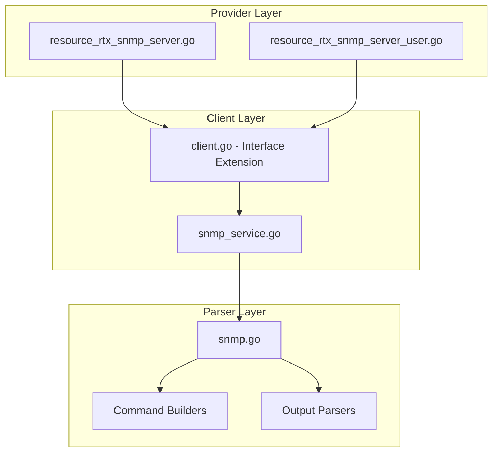

# Design Document: rtx_snmp

## Overview

The SNMP resources enable Terraform-based management of SNMP (Simple Network Management Protocol) configuration on Yamaha RTX series routers. Following Cisco IOS XE `iosxe_snmp_server` naming patterns, this specification covers two resources:

- **`rtx_snmp_server`**: SNMP agent, communities, trap destinations
- **`rtx_snmp_server_user`**: SNMPv3 user configuration

## Code Reuse Analysis

### Existing Components to Leverage

- **`internal/client/dhcp_scope_service.go`**: Pattern for service layer implementation with CRUD operations.
- **`internal/client/interfaces.go`**: Extend the `Client` interface with SNMP methods.
- **`internal/rtx/parsers/dhcp_scope.go`**: Reference for parser implementation and command builders.
- **`internal/provider/resource_rtx_dhcp_scope.go`**: Template for Terraform resource structure.

### Integration Points

- **`rtxClient`**: Add SNMP methods for CRUD operations
- **`Executor`**: Use existing SSH command execution infrastructure

## Architecture



### Modular Design Principles

- **Single File Responsibility**: `SNMPService` handles all SNMP CRUD operations
- **Component Isolation**: Parser, service, and resource layers clearly separated
- **Service Layer Separation**: Service encapsulates all SNMP logic
- **Utility Modularity**: Shared validation functions for community strings

## Components and Interfaces

### Component 1: SNMPService (`internal/client/snmp_service.go`)

- **Purpose:** Handles all SNMP CRUD operations against the RTX router
- **Interfaces:**
  ```go
  type SNMPService struct {
      executor Executor
      client   *rtxClient
  }

  func (s *SNMPService) Create(ctx context.Context, snmp SNMPConfig) error
  func (s *SNMPService) Get(ctx context.Context) (*SNMPConfig, error)
  func (s *SNMPService) Update(ctx context.Context, snmp SNMPConfig) error
  func (s *SNMPService) Delete(ctx context.Context) error
  ```
- **Dependencies:** `Executor`, `rtxClient`, `parsers.SNMPParser`
- **Reuses:** Pattern from service layer implementations

### Component 2: SNMPParser (`internal/rtx/parsers/snmp.go`)

- **Purpose:** Parses RTX router output for SNMP configuration and builds commands
- **Interfaces:**
  ```go
  type SNMPConfig struct {
      Location     string          `json:"location,omitempty"`
      Contact      string          `json:"contact,omitempty"`
      SysName      string          `json:"sysname,omitempty"`
      Communities  []SNMPCommunity `json:"communities"`
      Hosts        []SNMPHost      `json:"hosts"`
      EnableTraps  []string        `json:"enable_traps"`
  }

  type SNMPCommunity struct {
      Name       string `json:"name"`
      Permission string `json:"permission"`  // ro, rw
      ACL        string `json:"acl,omitempty"`
  }

  type SNMPHost struct {
      Address   string `json:"address"`
      Community string `json:"community,omitempty"`
      Version   string `json:"version"`  // 1, 2c, 3
  }

  func ParseSNMPConfig(raw string) (*SNMPConfig, error)
  func BuildSNMPSysLocationCommand(location string) string
  func BuildSNMPSysContactCommand(contact string) string
  func BuildSNMPSysNameCommand(name string) string
  func BuildSNMPCommunityCommand(community SNMPCommunity) string
  func BuildSNMPHostCommand(host SNMPHost) string
  func BuildSNMPTrapEnableCommand(trapType string) string
  func BuildDeleteSNMPCommand() string
  ```
- **Dependencies:** `regexp`, `strings`
- **Reuses:** IP validation patterns

### Component 3: Terraform Resources

#### 3.1 SNMPServer Resource (`internal/provider/resource_rtx_snmp_server.go`)

```go
func resourceRTXSNMPServer() *schema.Resource
func resourceRTXSNMPServerCreate(ctx, d, meta) diag.Diagnostics
func resourceRTXSNMPServerRead(ctx, d, meta) diag.Diagnostics
func resourceRTXSNMPServerUpdate(ctx, d, meta) diag.Diagnostics
func resourceRTXSNMPServerDelete(ctx, d, meta) diag.Diagnostics
func resourceRTXSNMPServerImport(ctx, d, meta) ([]*schema.ResourceData, error)
```

#### 3.2 SNMPServerUser Resource (`internal/provider/resource_rtx_snmp_server_user.go`)

```go
func resourceRTXSNMPServerUser() *schema.Resource
func resourceRTXSNMPServerUserCreate(ctx, d, meta) diag.Diagnostics
func resourceRTXSNMPServerUserRead(ctx, d, meta) diag.Diagnostics
func resourceRTXSNMPServerUserUpdate(ctx, d, meta) diag.Diagnostics
func resourceRTXSNMPServerUserDelete(ctx, d, meta) diag.Diagnostics
func resourceRTXSNMPServerUserImport(ctx, d, meta) ([]*schema.ResourceData, error)
```

- **Dependencies:** `Client`, `SNMPConfig`, Terraform SDK
- **Reuses:** Resource patterns from other implementations

### Component 4: Client Interface Extension (`internal/client/interfaces.go`)

- **Purpose:** Extend Client interface with SNMP methods
- **Interfaces:**
  ```go
  // Add to existing Client interface:
  GetSNMP(ctx context.Context) (*SNMPConfig, error)
  CreateSNMP(ctx context.Context, snmp SNMPConfig) error
  UpdateSNMP(ctx context.Context, snmp SNMPConfig) error
  DeleteSNMP(ctx context.Context) error
  ```
- **Dependencies:** Existing Client interface
- **Reuses:** Pattern from existing methods

## Data Models

### SNMPConfig

```go
// SNMPConfig represents SNMP configuration on an RTX router
type SNMPConfig struct {
    Location    string          `json:"location,omitempty"`  // sysLocation
    Contact     string          `json:"contact,omitempty"`   // sysContact
    SysName     string          `json:"sysname,omitempty"`   // sysName
    Communities []SNMPCommunity `json:"communities"`         // Community strings
    Hosts       []SNMPHost      `json:"hosts"`               // Trap destinations
    EnableTraps []string        `json:"enable_traps"`        // Enabled trap types
}

// SNMPCommunity represents a community string configuration
type SNMPCommunity struct {
    Name       string `json:"name"`       // Community string (sensitive)
    Permission string `json:"permission"` // ro or rw
    ACL        string `json:"acl"`        // Access control list name
}

// SNMPHost represents a trap destination
type SNMPHost struct {
    Address   string `json:"address"`   // Manager IP address
    Community string `json:"community"` // Trap community (sensitive)
    Version   string `json:"version"`   // SNMP version (1, 2c, 3)
}
```

### Terraform Schema

```hcl
# SNMP server configuration
resource "rtx_snmp_server" "monitoring" {
  location = "Tokyo DC Rack 42"
  contact  = "noc@example.com"

  # Community strings
  communities = [
    {
      name       = var.snmp_community_ro
      permission = "ro"
      acl        = "SNMP_ACCESS"
    },
    {
      name       = var.snmp_community_rw
      permission = "rw"
      acl        = "SNMP_ACCESS"
    }
  ]

  # Trap destinations
  hosts = [
    {
      address   = "10.0.0.100"
      community = var.snmp_trap_community
      version   = "2c"
    },
    {
      address   = "10.0.0.101"
      community = var.snmp_trap_community
      version   = "2c"
    }
  ]

  # Enable traps
  enable_traps = ["snmp", "linkdown", "linkup", "coldstart"]
}

# SNMPv3 user (separate resource)
resource "rtx_snmp_server_user" "admin" {
  username = "snmpadmin"
  group    = "ADMIN_GROUP"

  auth_protocol = "sha"
  auth_password = var.snmpv3_auth_password

  priv_protocol = "aes128"
  priv_password = var.snmpv3_priv_password
}
```

## RTX Command Mapping

### Configure System Information

```
snmp sysname <name>
snmp syslocation <location>
snmp syscontact <contact>
```

### Configure Community Strings

```
snmp community read-only <string>
snmp community read-write <string>
```

### Configure Trap Destination

```
snmp host <ip> [community <string>]
snmp trap host <ip>
```

### Configure Trap Community

```
snmp trap community <string>
```

### Enable Traps

```
snmp trap enable snmp [all|<trap_type>]
```

Example: `snmp trap enable snmp linkdown linkup`

### Delete SNMP Configuration

```
no snmp host <ip>
no snmp community read-only
no snmp community read-write
```

### Show Configuration

```
show config | grep snmp
show snmp
```

## Error Handling

### Error Scenarios

1. **Invalid IP Address**
   - **Handling:** Validate trap destination IP format
   - **User Impact:** Clear validation error with expected format

2. **Invalid SNMP Version**
   - **Handling:** Validate version is 1, 2c, or 3
   - **User Impact:** Error with valid versions

3. **Invalid Trap Type**
   - **Handling:** Validate trap type is supported
   - **User Impact:** Error with valid trap types

4. **Empty Community String**
   - **Handling:** Require non-empty community string
   - **User Impact:** Validation error

5. **Connection/Command Timeout**
   - **Handling:** Use existing retry logic from `rtxClient`
   - **User Impact:** Standard Terraform timeout error

## Testing Strategy

### Unit Testing

- **Parser Tests** (`snmp_test.go`):
  - Parse various RTX `show config` output for SNMP
  - Test command builder functions with different parameters
  - Test community string handling

- **Service Tests** (`snmp_service_test.go`):
  - Mock executor for service method testing
  - Test error handling for various failure scenarios
  - Test trap configuration

### Integration Testing

- **Resource Tests**:
  - `resource_rtx_snmp_server_test.go`
  - `resource_rtx_snmp_server_user_test.go`
  - Full CRUD lifecycle with mock client
  - Import functionality testing
  - Sensitive attribute handling

### End-to-End Testing

- **Acceptance Tests** (with real RTX router):
  - Create SNMP with communities
  - Configure trap destinations
  - Enable traps
  - Update configuration
  - Delete SNMP settings
  - Import existing SNMP

## File Structure

```
internal/
├── provider/
│   ├── resource_rtx_snmp_server.go          # NEW: SNMP server resource
│   ├── resource_rtx_snmp_server_test.go     # NEW: SNMP server tests
│   ├── resource_rtx_snmp_server_user.go     # NEW: SNMPv3 user resource
│   └── resource_rtx_snmp_server_user_test.go # NEW: SNMPv3 user tests
├── client/
│   ├── interfaces.go              # MODIFY: Add SNMP types and methods
│   ├── client.go                  # MODIFY: Add SNMP service initialization
│   ├── snmp_service.go           # NEW: SNMP service implementation
│   └── snmp_service_test.go      # NEW: Service tests
└── rtx/
    └── parsers/
        ├── snmp.go               # NEW: Parser and command builders
        └── snmp_test.go          # NEW: Parser tests
```

## Implementation Notes

1. **Singleton Resource**: SNMP is a singleton resource. Only one SNMP configuration can exist.

2. **Terraform ID**: Use "snmp" as the fixed Terraform resource ID.

3. **Sensitive Data**: Community strings must be marked as sensitive in Terraform state.

4. **SNMPv3**: Consider as separate resource `rtx_snmp_server_user` due to complexity.

5. **ACL Integration**: Community ACLs reference IP filter resources.

6. **Trap Types**: Common types: snmp, linkdown, linkup, coldstart, warmstart.

7. **In-place Updates**: Most SNMP settings support in-place updates.

8. **Security**: Recommend using SNMPv3 over v1/v2c for sensitive environments.

9. **Configuration Save**: Use existing `SaveConfig()` pattern after modifications.

10. **Provider Registration**: Add `resourceRTXSNMPServer` and `resourceRTXSNMPServerUser` to provider's resource map.

## State Handling

- Persist only configuration attributes in Terraform state.
- Operational/runtime status must not be stored in state to avoid perpetual diffs.
