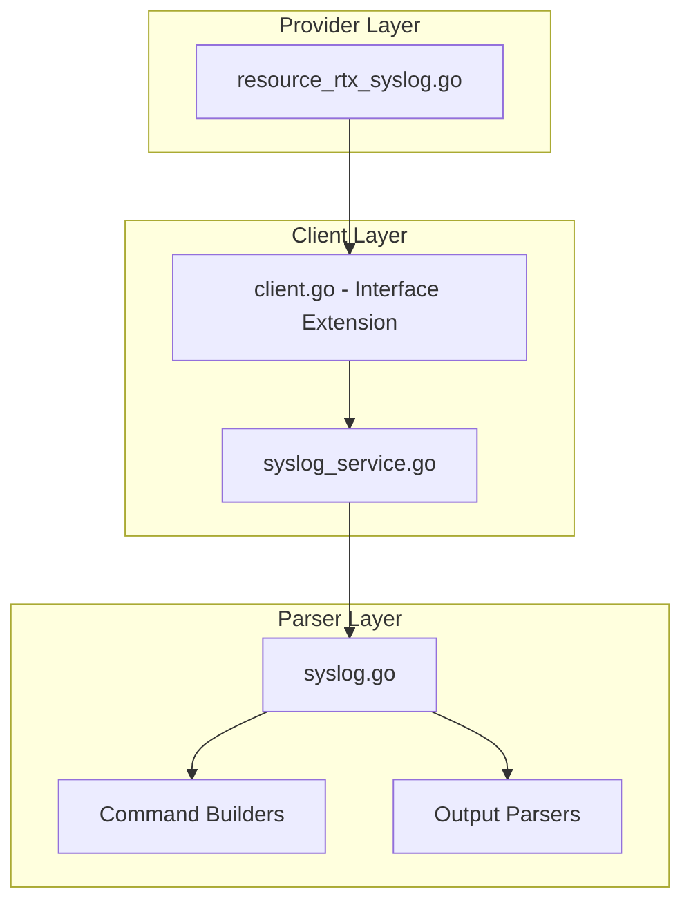

# Design Document: rtx_syslog

## Overview

The `rtx_syslog` resource enables Terraform-based management of syslog configuration on Yamaha RTX series routers. Syslog is essential for centralized logging, monitoring, and compliance in enterprise environments.

## Scope

This resource manages **syslog configuration** including:
- Remote syslog server configuration
- Local address for syslog packets
- Syslog facility setting
- Log level controls (notice, info, debug)

## Code Reuse Analysis

### Existing Components to Leverage

- **`internal/client/dhcp_scope_service.go`**: Pattern for service layer implementation with CRUD operations.
- **`internal/client/interfaces.go`**: Extend the `Client` interface with syslog methods.
- **`internal/rtx/parsers/`**: Reference for parser implementation patterns.
- **`internal/provider/resource_rtx_dhcp_scope.go`**: Template for Terraform resource structure.

### Integration Points

- **`rtxClient`**: Add syslog methods for CRUD operations
- **`Executor`**: Use existing SSH command execution infrastructure

## Architecture



## Components and Interfaces

### Component 1: SyslogService (`internal/client/syslog_service.go`)

- **Purpose:** Handles all syslog CRUD operations against the RTX router
- **Interfaces:**
  ```go
  type SyslogService struct {
      executor Executor
      client   *rtxClient
  }

  func (s *SyslogService) Configure(ctx context.Context, config SyslogConfig) error
  func (s *SyslogService) Get(ctx context.Context) (*SyslogConfig, error)
  func (s *SyslogService) Update(ctx context.Context, config SyslogConfig) error
  func (s *SyslogService) Reset(ctx context.Context) error
  ```
- **Dependencies:** `Executor`, `rtxClient`, `parsers.SyslogParser`

### Component 2: SyslogParser (`internal/rtx/parsers/syslog.go`)

- **Purpose:** Parses RTX router output for syslog configuration and builds commands
- **Interfaces:**
  ```go
  type SyslogConfig struct {
      Hosts        []SyslogHost `json:"hosts"`
      LocalAddress string       `json:"local_address,omitempty"`
      Facility     string       `json:"facility"`
      Notice       bool         `json:"notice"`
      Info         bool         `json:"info"`
      Debug        bool         `json:"debug"`
  }

  type SyslogHost struct {
      Address string `json:"address"` // IP address or hostname
      Port    int    `json:"port,omitempty"` // Default 514
  }

  func ParseSyslogConfig(raw string) (*SyslogConfig, error)
  func BuildSyslogHostCommand(host SyslogHost) string
  func BuildSyslogLocalAddressCommand(addr string) string
  func BuildSyslogFacilityCommand(facility string) string
  func BuildSyslogLevelCommand(level string, enabled bool) string
  func BuildDeleteSyslogCommand() string
  ```
- **Dependencies:** `regexp`, `strings`, `strconv`

### Component 3: Terraform Resource (`internal/provider/resource_rtx_syslog.go`)

- **Purpose:** Terraform resource definition implementing CRUD lifecycle
- **Interfaces:**
  ```go
  func resourceRTXSyslog() *schema.Resource
  func resourceRTXSyslogCreate(ctx, d, meta) diag.Diagnostics
  func resourceRTXSyslogRead(ctx, d, meta) diag.Diagnostics
  func resourceRTXSyslogUpdate(ctx, d, meta) diag.Diagnostics
  func resourceRTXSyslogDelete(ctx, d, meta) diag.Diagnostics
  func resourceRTXSyslogImport(ctx, d, meta) ([]*schema.ResourceData, error)
  ```
- **Dependencies:** `Client`, `SyslogConfig`, Terraform SDK

### Component 4: Client Interface Extension (`internal/client/interfaces.go`)

- **Purpose:** Extend Client interface with syslog methods
- **Interfaces:**
  ```go
  // Add to existing Client interface:
  GetSyslogConfig(ctx context.Context) (*SyslogConfig, error)
  ConfigureSyslog(ctx context.Context, config SyslogConfig) error
  UpdateSyslogConfig(ctx context.Context, config SyslogConfig) error
  ResetSyslog(ctx context.Context) error
  ```
- **Dependencies:** Existing Client interface

## Data Models

### SyslogConfig

```go
// SyslogConfig represents syslog configuration on an RTX router
type SyslogConfig struct {
    Hosts        []SyslogHost `json:"hosts"`                  // Remote syslog servers
    LocalAddress string       `json:"local_address,omitempty"` // Source IP for syslog packets
    Facility     string       `json:"facility"`               // Syslog facility (local0-local7, etc.)
    Notice       bool         `json:"notice"`                 // Enable notice level logs
    Info         bool         `json:"info"`                   // Enable info level logs
    Debug        bool         `json:"debug"`                  // Enable debug level logs
}

// SyslogHost represents a remote syslog server
type SyslogHost struct {
    Address string `json:"address"`        // IP address or hostname
    Port    int    `json:"port,omitempty"` // UDP port (default 514)
}
```

### Terraform Schema

```hcl
resource "rtx_syslog" "main" {
  # Remote syslog servers
  host {
    address = "192.168.1.20"
    # port = 514  # Optional, default 514
  }

  # Optional: additional syslog server
  host {
    address = "192.168.1.21"
    port    = 1514
  }

  # Source address for syslog packets
  local_address = "192.168.1.253"

  # Syslog facility (local0 - local7, user, daemon, etc.)
  facility = "local0"

  # Log levels
  notice = true  # Enable notice level
  info   = true  # Enable info level
  debug  = true  # Enable debug level (verbose)
}
```

## RTX Command Mapping

### Configure Syslog Host

```
syslog host <address>
syslog host <address> <port>
```

Examples:
```
syslog host 192.168.1.20
syslog host 192.168.1.21 1514
```

### Configure Local Address

```
syslog local address <ip_address>
```

Example: `syslog local address 192.168.1.253`

### Configure Facility

```
syslog facility <facility>
```

Valid facilities: `kern`, `user`, `mail`, `daemon`, `auth`, `syslog`, `lpr`, `news`, `uucp`, `cron`, `local0` - `local7`

Example: `syslog facility local0`

### Configure Log Levels

```
syslog notice on|off
syslog info on|off
syslog debug on|off
```

Examples:
```
syslog notice on
syslog info on
syslog debug on
```

### Remove Syslog Configuration

```
no syslog host <address>
no syslog local address
no syslog facility
no syslog notice
no syslog info
no syslog debug
```

### Show Configuration

```
show config | grep syslog
show syslog
```

## Error Handling

### Error Scenarios

1. **Invalid Host Address**
   - **Handling:** Validate IP address or hostname format
   - **User Impact:** Clear validation error with expected format

2. **Invalid Port**
   - **Handling:** Validate port is in range 1-65535
   - **User Impact:** Clear error with valid range

3. **Invalid Facility**
   - **Handling:** Validate facility is in allowed list
   - **User Impact:** Error with valid facilities

4. **Invalid Local Address**
   - **Handling:** Validate IP address format
   - **User Impact:** Clear error with expected format

5. **Connection/Command Timeout**
   - **Handling:** Use existing retry logic from `rtxClient`
   - **User Impact:** Standard Terraform timeout error

## Testing Strategy

### Unit Testing

- **Parser Tests** (`syslog_test.go`):
  - Parse various RTX `show config` output for syslog settings
  - Test command builder functions with different parameters
  - Test facility validation

- **Service Tests** (`syslog_service_test.go`):
  - Mock executor for service method testing
  - Test error handling for various failure scenarios
  - Test multiple host configuration

### Integration Testing

- **Resource Tests** (`resource_rtx_syslog_test.go`):
  - Full CRUD lifecycle with mock client
  - Import functionality testing
  - Multi-host configuration testing

### End-to-End Testing

- **Acceptance Tests** (with real RTX router):
  - Configure single syslog server
  - Configure multiple syslog servers
  - Configure with local address
  - Configure facility
  - Enable/disable log levels
  - Update configuration
  - Remove configuration
  - Import existing syslog

## File Structure

```
internal/
├── provider/
│   ├── resource_rtx_syslog.go      # NEW: Terraform resource
│   └── resource_rtx_syslog_test.go # NEW: Resource tests
├── client/
│   ├── interfaces.go                # MODIFY: Add SyslogConfig types and methods
│   ├── client.go                    # MODIFY: Add syslog service initialization
│   ├── syslog_service.go           # NEW: Syslog service implementation
│   └── syslog_service_test.go      # NEW: Service tests
└── rtx/
    └── parsers/
        ├── syslog.go               # NEW: Parser and command builders
        └── syslog_test.go          # NEW: Parser tests
```

## Implementation Notes

1. **Singleton Resource**: Syslog configuration is global to the router. Use a fixed ID like `"syslog"`.

2. **Multiple Hosts**: RTX supports multiple syslog hosts. Use TypeSet for hosts.

3. **Default Facility**: If not specified, RTX uses `user` facility.

4. **Log Level Defaults**: By default, only `notice` is enabled. Explicit configuration recommended.

5. **Local Address**: Optional. If not set, RTX uses the outgoing interface IP.

6. **UDP Only**: RTX syslog uses UDP only (no TCP/TLS support).

7. **Configuration Save**: Use existing `SaveConfig()` pattern after modifications.

8. **Provider Registration**: Add `resourceRTXSyslog` to provider's resource map.

9. **Import**: Import uses fixed ID `"syslog"` since it's a singleton resource.

10. **Sensitive Data**: Syslog content may contain sensitive information. Document security considerations.

## State Handling

- Persist only configuration attributes in Terraform state.
- Operational/runtime status must not be stored in state to avoid perpetual diffs.
