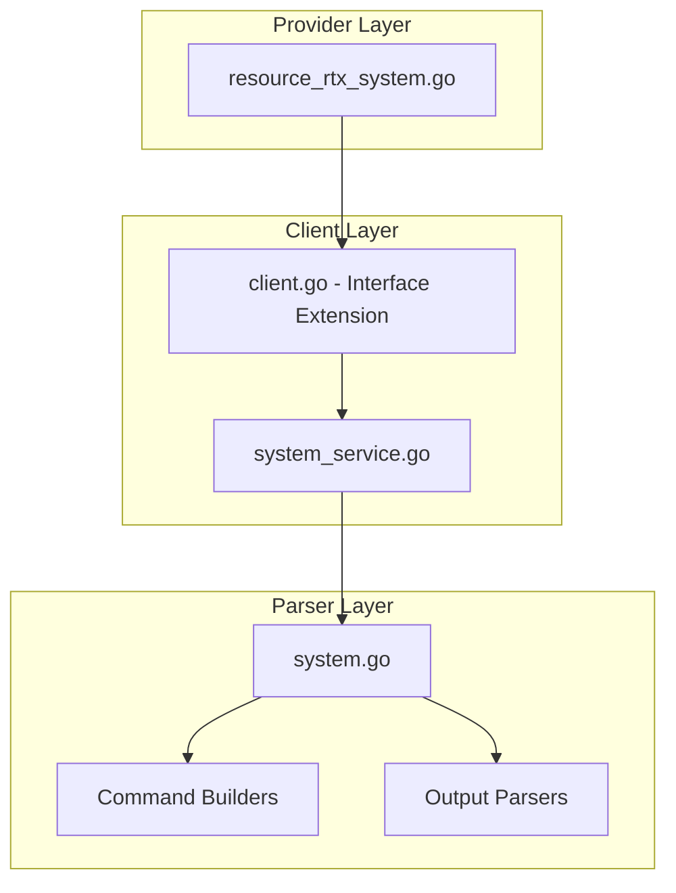

# Design Document: rtx_system

## Overview

The `rtx_system` resource enables Terraform-based management of system-level settings on Yamaha RTX series routers. This includes timezone, console settings, packet buffer tuning, and statistics collection.

## Scope

This resource manages **system-level configuration** including:
- Timezone settings
- Console settings (character encoding, lines, prompt)
- System packet buffer tuning
- Statistics collection (traffic, NAT)
- External memory settings

**Note**: This is a singleton resource - there is only one system configuration per router.

## Code Reuse Analysis

### Existing Components to Leverage

- **`internal/client/dhcp_scope_service.go`**: Pattern for service layer implementation.
- **`internal/client/interfaces.go`**: Extend the `Client` interface with system methods.
- **`internal/rtx/parsers/`**: Reference for parser implementation patterns.
- **`internal/provider/resource_rtx_dhcp_scope.go`**: Template for Terraform resource structure.

### Integration Points

- **`rtxClient`**: Add system configuration methods
- **`Executor`**: Use existing SSH command execution infrastructure

## Architecture



## Components and Interfaces

### Component 1: SystemService (`internal/client/system_service.go`)

- **Purpose:** Handles all system CRUD operations against the RTX router
- **Interfaces:**
  ```go
  type SystemService struct {
      executor Executor
      client   *rtxClient
  }

  func (s *SystemService) Configure(ctx context.Context, config SystemConfig) error
  func (s *SystemService) Get(ctx context.Context) (*SystemConfig, error)
  func (s *SystemService) Update(ctx context.Context, config SystemConfig) error
  func (s *SystemService) Reset(ctx context.Context) error
  ```
- **Dependencies:** `Executor`, `rtxClient`, `parsers.SystemParser`

### Component 2: SystemParser (`internal/rtx/parsers/system.go`)

- **Purpose:** Parses RTX router output for system configuration and builds commands
- **Interfaces:**
  ```go
  type SystemConfig struct {
      Timezone      string               `json:"timezone"`
      Console       *ConsoleConfig       `json:"console,omitempty"`
      PacketBuffers []PacketBufferConfig `json:"packet_buffers,omitempty"`
      Statistics    *StatisticsConfig    `json:"statistics,omitempty"`
  }

  type ConsoleConfig struct {
      Character string `json:"character"` // ja.utf8, ascii, etc.
      Lines     string `json:"lines"`     // number or "infinity"
      Prompt    string `json:"prompt"`    // Custom prompt string
  }

  type PacketBufferConfig struct {
      Size      string `json:"size"`       // small, middle, large
      MaxBuffer int    `json:"max_buffer"`
      MaxFree   int    `json:"max_free"`
  }

  type StatisticsConfig struct {
      Traffic bool `json:"traffic"`
      NAT     bool `json:"nat"`
  }

  func ParseSystemConfig(raw string) (*SystemConfig, error)
  func BuildTimezoneCommand(tz string) string
  func BuildConsoleCommand(config ConsoleConfig) []string
  func BuildPacketBufferCommand(config PacketBufferConfig) string
  func BuildStatisticsCommand(config StatisticsConfig) []string
  ```
- **Dependencies:** `regexp`, `strings`, `strconv`

### Component 3: Terraform Resource (`internal/provider/resource_rtx_system.go`)

- **Purpose:** Terraform resource definition implementing CRUD lifecycle
- **Interfaces:**
  ```go
  func resourceRTXSystem() *schema.Resource
  func resourceRTXSystemCreate(ctx, d, meta) diag.Diagnostics
  func resourceRTXSystemRead(ctx, d, meta) diag.Diagnostics
  func resourceRTXSystemUpdate(ctx, d, meta) diag.Diagnostics
  func resourceRTXSystemDelete(ctx, d, meta) diag.Diagnostics
  func resourceRTXSystemImport(ctx, d, meta) ([]*schema.ResourceData, error)
  ```
- **Dependencies:** `Client`, `SystemConfig`, Terraform SDK

### Component 4: Client Interface Extension (`internal/client/interfaces.go`)

- **Purpose:** Extend Client interface with system methods
- **Interfaces:**
  ```go
  // Add to existing Client interface:
  GetSystemConfig(ctx context.Context) (*SystemConfig, error)
  ConfigureSystem(ctx context.Context, config SystemConfig) error
  UpdateSystemConfig(ctx context.Context, config SystemConfig) error
  ResetSystem(ctx context.Context) error
  ```
- **Dependencies:** Existing Client interface

## Data Models

### SystemConfig

```go
// SystemConfig represents system-level configuration on an RTX router
type SystemConfig struct {
    Timezone      string               `json:"timezone"`               // UTC offset (e.g., "+09:00")
    Console       *ConsoleConfig       `json:"console,omitempty"`      // Console settings
    PacketBuffers []PacketBufferConfig `json:"packet_buffers,omitempty"` // Packet buffer tuning
    Statistics    *StatisticsConfig    `json:"statistics,omitempty"`   // Statistics collection
}

// ConsoleConfig represents console settings
type ConsoleConfig struct {
    Character string `json:"character"` // Character encoding (ja.utf8, ascii, ja.sjis)
    Lines     string `json:"lines"`     // Lines per page (number or "infinity")
    Prompt    string `json:"prompt"`    // Custom prompt string
}

// PacketBufferConfig represents packet buffer tuning for each size
type PacketBufferConfig struct {
    Size      string `json:"size"`       // "small", "middle", or "large"
    MaxBuffer int    `json:"max_buffer"` // Maximum buffer count
    MaxFree   int    `json:"max_free"`   // Maximum free buffer count
}

// StatisticsConfig represents statistics collection settings
type StatisticsConfig struct {
    Traffic bool `json:"traffic"` // Traffic statistics
    NAT     bool `json:"nat"`     // NAT statistics
}
```

### Terraform Schema

```hcl
resource "rtx_system" "main" {
  # Timezone (UTC offset)
  timezone = "+09:00"  # Japan Standard Time

  # Console settings
  console {
    character = "ja.utf8"
    lines     = "infinity"
    prompt    = "[RTX1210] "
  }

  # Packet buffer tuning (optional, for high-traffic environments)
  packet_buffer {
    size       = "small"
    max_buffer = 5000
    max_free   = 1300
  }

  packet_buffer {
    size       = "middle"
    max_buffer = 10000
    max_free   = 4950
  }

  packet_buffer {
    size       = "large"
    max_buffer = 20000
    max_free   = 5600
  }

  # Statistics collection
  statistics {
    traffic = true
    nat     = true
  }
}
```

## RTX Command Mapping

### Configure Timezone

```
timezone <utc_offset>
```

Example: `timezone +09:00`

### Configure Console

```
console character <encoding>
console lines <number|infinity>
console prompt "<prompt>"
```

Examples:
```
console character ja.utf8
console lines infinity
console prompt "[RTX1210] "
```

### Configure Packet Buffers

```
system packet-buffer <size> max-buffer=<n> max-free=<n>
```

Examples:
```
system packet-buffer small max-buffer=5000 max-free=1300
system packet-buffer middle max-buffer=10000 max-free=4950
system packet-buffer large max-buffer=20000 max-free=5600
```

### Configure Statistics

```
statistics traffic on|off
statistics nat on|off
```

Examples:
```
statistics traffic on
statistics nat on
```

### Remove Configuration

```
no timezone
no console character
no console lines
no console prompt
no system packet-buffer small
no system packet-buffer middle
no system packet-buffer large
no statistics traffic
no statistics nat
```

### Show Configuration

```
show environment
show config | grep -E "(timezone|console|packet-buffer|statistics)"
```

## Error Handling

### Error Scenarios

1. **Invalid Timezone Format**
   - **Handling:** Validate UTC offset format (±HH:MM)
   - **User Impact:** Clear validation error with expected format

2. **Invalid Character Encoding**
   - **Handling:** Validate encoding is supported
   - **User Impact:** Error with valid encodings

3. **Invalid Packet Buffer Values**
   - **Handling:** Validate values are positive integers within limits
   - **User Impact:** Clear error with valid ranges

4. **Connection/Command Timeout**
   - **Handling:** Use existing retry logic from `rtxClient`
   - **User Impact:** Standard Terraform timeout error

## Testing Strategy

### Unit Testing

- **Parser Tests** (`system_test.go`):
  - Parse various RTX `show config` output for system settings
  - Test command builder functions with different parameters
  - Test timezone format validation

- **Service Tests** (`system_service_test.go`):
  - Mock executor for service method testing
  - Test error handling for various failure scenarios
  - Test partial configuration updates

### Integration Testing

- **Resource Tests** (`resource_rtx_system_test.go`):
  - Full CRUD lifecycle with mock client
  - Import functionality testing
  - Partial configuration testing

### End-to-End Testing

- **Acceptance Tests** (with real RTX router):
  - Configure timezone
  - Configure console settings
  - Configure packet buffers
  - Configure statistics
  - Update configuration
  - Reset to defaults
  - Import existing configuration

## File Structure

```
internal/
├── provider/
│   ├── resource_rtx_system.go      # NEW: Terraform resource
│   └── resource_rtx_system_test.go # NEW: Resource tests
├── client/
│   ├── interfaces.go                # MODIFY: Add SystemConfig types and methods
│   ├── client.go                    # MODIFY: Add system service initialization
│   ├── system_service.go           # NEW: System service implementation
│   └── system_service_test.go      # NEW: Service tests
└── rtx/
    └── parsers/
        ├── system.go               # NEW: Parser and command builders
        └── system_test.go          # NEW: Parser tests
```

## Implementation Notes

1. **Singleton Resource**: System configuration is global. Use fixed ID `"system"`.

2. **All Optional**: All attributes are optional. Unset values use router defaults.

3. **Timezone Format**: RTX uses `±HH:MM` format (e.g., `+09:00`, `-05:00`).

4. **Prompt Quoting**: Prompt string must be quoted if it contains spaces.

5. **Packet Buffer Sizes**: Only "small", "middle", and "large" are valid.

6. **Statistics**: Enabling statistics may impact performance on high-traffic routers.

7. **Configuration Save**: Use existing `SaveConfig()` pattern after modifications.

8. **Provider Registration**: Add `resourceRTXSystem` to provider's resource map.

9. **Import**: Import uses fixed ID `"system"` since it's a singleton resource.

10. **Performance Impact**: Packet buffer changes may require router restart to take full effect.

## State Handling

- Persist only configuration attributes in Terraform state.
- Operational/runtime status must not be stored in state to avoid perpetual diffs.
