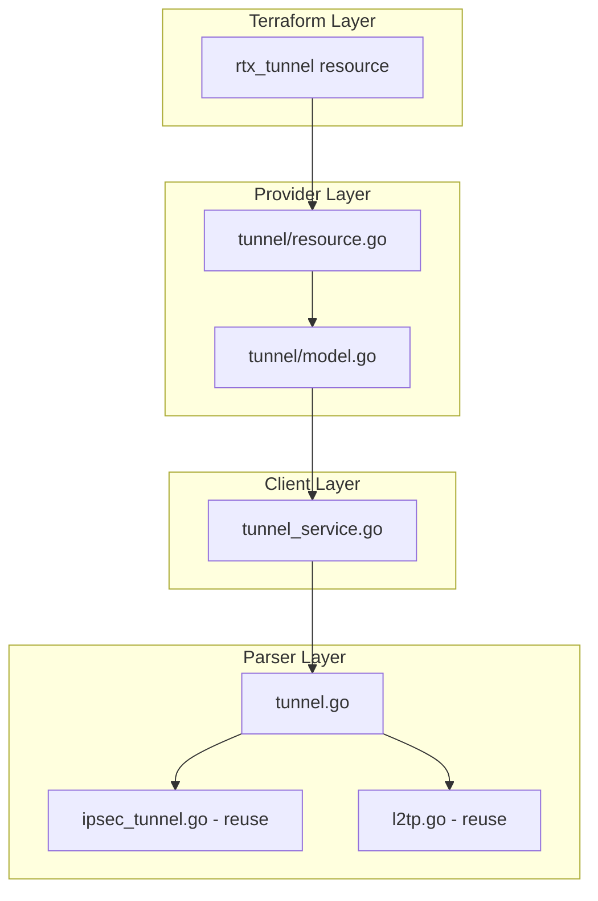

# Design Document: rtx_tunnel (Unified Tunnel Resource)

## Overview

The `rtx_tunnel` resource unifies IPsec and L2TP configuration into a single Terraform resource that mirrors RTX's actual command structure where `tunnel select N` is the parent container.

## Architecture



## Data Models

### Tunnel (unified)

```go
// Tunnel represents a unified tunnel configuration
type Tunnel struct {
    ID               int          `json:"id"`                           // tunnel select N (1-6000)
    Encapsulation    string       `json:"encapsulation"`                // "ipsec", "l2tpv3", or "l2tp"
    Enabled          bool         `json:"enabled"`                      // tunnel enable N
    Name             string       `json:"name,omitempty"`               // Description (Computed/read-only)
    EndpointName     string       `json:"endpoint_name,omitempty"`      // tunnel endpoint name <addr>
    EndpointNameType string       `json:"endpoint_name_type,omitempty"` // fqdn
    IPsec            *TunnelIPsec `json:"ipsec,omitempty"`
    L2TP             *TunnelL2TP  `json:"l2tp,omitempty"`
}

// TunnelIPsec represents IPsec settings within a tunnel
type TunnelIPsec struct {
    IPsecTunnelID     int                   `json:"ipsec_tunnel_id"`                // ipsec tunnel N (Computed: defaults to tunnel_id)
    LocalAddress      string                `json:"local_address,omitempty"`
    RemoteAddress     string                `json:"remote_address,omitempty"`
    PreSharedKey      string                `json:"pre_shared_key"`                 // WriteOnly
    NATTraversal      bool                  `json:"nat_traversal"`                  // ipsec ike nat-traversal
    IKERemoteName     string                `json:"ike_remote_name,omitempty"`      // ipsec ike remote name value
    IKERemoteNameType string                `json:"ike_remote_name_type,omitempty"` // ipsec ike remote name type
    IKEKeepaliveLog   bool                  `json:"ike_keepalive_log"`              // ipsec ike keepalive log
    IKELog            string                `json:"ike_log,omitempty"`              // ipsec ike log options
    Transform         IPsecTransform        `json:"transform"`
    Keepalive         *TunnelIPsecKeepalive `json:"keepalive,omitempty"`
    SecureFilterIn    []int                 `json:"secure_filter_in,omitempty"`
    SecureFilterOut   []int                 `json:"secure_filter_out,omitempty"`
    TCPMSSLimit       string                `json:"tcp_mss_limit,omitempty"`
}

// IPsecTransform represents IPsec Phase 2 transform settings
type IPsecTransform struct {
    Protocol         string `json:"protocol"`           // esp or ah (default: esp)
    EncryptionAES256 bool   `json:"encryption_aes256"`
    EncryptionAES128 bool   `json:"encryption_aes128"`
    Encryption3DES   bool   `json:"encryption_3des"`
    IntegritySHA256  bool   `json:"integrity_sha256"`
    IntegritySHA1    bool   `json:"integrity_sha1"`
    IntegrityMD5     bool   `json:"integrity_md5"`
}

// TunnelIPsecKeepalive represents DPD/heartbeat settings
type TunnelIPsecKeepalive struct {
    Enabled  bool   `json:"enabled"`
    Mode     string `json:"mode"`      // dpd or heartbeat (default: dpd)
    Interval int    `json:"interval"`
    Retry    int    `json:"retry"`
}

// TunnelL2TP represents L2TP settings within a tunnel
type TunnelL2TP struct {
    // Common L2TP settings
    Hostname       string               `json:"hostname,omitempty"`
    AlwaysOn       bool                 `json:"always_on,omitempty"`
    DisconnectTime int                  `json:"disconnect_time,omitempty"` // 0 = off
    KeepaliveLog   bool                 `json:"keepalive_log"`             // l2tp keepalive log
    Keepalive      *TunnelL2TPKeepalive `json:"keepalive,omitempty"`
    Syslog         bool                 `json:"syslog"`                    // l2tp syslog on

    // L2TPv3 specific
    LocalRouterID  string          `json:"local_router_id,omitempty"`
    RemoteRouterID string          `json:"remote_router_id,omitempty"`
    RemoteEndID    string          `json:"remote_end_id,omitempty"`
    TunnelAuth     *TunnelL2TPAuth `json:"tunnel_auth,omitempty"`

    // L2TPv2 specific
    Authentication *L2TPAuth   `json:"authentication,omitempty"`
    IPPool         *L2TPIPPool `json:"ip_pool,omitempty"`
}

// TunnelL2TPKeepalive represents L2TP keepalive settings
type TunnelL2TPKeepalive struct {
    Enabled  bool `json:"enabled"`
    Interval int  `json:"interval"`
    Retry    int  `json:"retry"`
}

// TunnelL2TPAuth represents L2TP tunnel authentication
type TunnelL2TPAuth struct {
    Enabled  bool   `json:"enabled"`
    Password string `json:"password"`
}

// L2TPAuth represents L2TPv2 PPP authentication
type L2TPAuth struct {
    Method   string `json:"method"`   // pap, chap, mschap, mschap-v2
    Username string `json:"username,omitempty"`
    Password string `json:"password,omitempty"`
}

// L2TPIPPool represents L2TPv2 IP pool for remote access
type L2TPIPPool struct {
    Start string `json:"start"`
    End   string `json:"end"`
}
```

## Terraform Schema

```go
func (r *TunnelResource) Schema(ctx context.Context, req resource.SchemaRequest, resp *resource.SchemaResponse) {
    resp.Schema = schema.Schema{
        Description: "Manages unified tunnel configuration on RTX routers. Supports IPsec, L2TPv3, and L2TPv2 tunnels.",
        Attributes: map[string]schema.Attribute{
            "tunnel_id": schema.Int64Attribute{
                Description: "Tunnel ID (tunnel select N, 1-6000).",
                Required:    true,
                PlanModifiers: []planmodifier.Int64{
                    int64planmodifier.RequiresReplace(),
                },
                Validators: []validator.Int64{
                    int64validator.Between(1, 6000),
                },
            },
            "encapsulation": schema.StringAttribute{
                Description: "Tunnel encapsulation type: 'ipsec' (site-to-site VPN), 'l2tpv3' (L2VPN), or 'l2tp' (L2TPv2 remote access).",
                Required:    true,
                Validators: []validator.String{
                    stringvalidator.OneOf("ipsec", "l2tpv3", "l2tp"),
                },
            },
            "enabled": schema.BoolAttribute{
                Description: "Enable the tunnel.",
                Optional:    true,
                Computed:    true,
                Default:     booldefault.StaticBool(true),
            },
            "name": schema.StringAttribute{
                Description: "Tunnel description/name. Read-only - RTX does not support setting description within tunnel context.",
                Computed:    true,  // NOTE: This is read-only (Computed), not Optional
                PlanModifiers: []planmodifier.String{
                    stringplanmodifier.UseStateForUnknown(),
                },
            },
            "tunnel_interface": schema.StringAttribute{
                Description: "The tunnel interface name (e.g., 'tunnel1'). Computed from tunnel_id.",
                Computed:    true,
                PlanModifiers: []planmodifier.String{
                    stringplanmodifier.UseStateForUnknown(),
                },
            },
            "endpoint_name": schema.StringAttribute{
                Description: "Tunnel endpoint name for DNS resolution.",
                Optional:    true,
            },
            "endpoint_name_type": schema.StringAttribute{
                Description: "Endpoint name type: 'fqdn'.",
                Optional:    true,
                Validators: []validator.String{
                    stringvalidator.OneOf("fqdn"),
                },
            },
        },
        Blocks: map[string]schema.Block{
            "ipsec": schema.SingleNestedBlock{
                Description: "IPsec configuration for the tunnel.",
                Attributes: map[string]schema.Attribute{
                    "ipsec_tunnel_id": schema.Int64Attribute{
                        Description: "IPsec tunnel ID (ipsec tunnel N). Defaults to tunnel_id if not specified.",
                        Optional:    true,
                        Computed:    true,
                    },
                    "local_address": schema.StringAttribute{
                        Description: "Local IKE endpoint address.",
                        Optional:    true,
                        Computed:    true,
                    },
                    "remote_address": schema.StringAttribute{
                        Description: "Remote IKE endpoint address or FQDN.",
                        Optional:    true,
                        Computed:    true,
                    },
                    "pre_shared_key": schema.StringAttribute{
                        Description: "IKE pre-shared key. This value is write-only and will not be stored in state.",
                        Required:    true,
                        Sensitive:   true,
                        WriteOnly:   true,
                    },
                    "nat_traversal": schema.BoolAttribute{
                        Description: "Enable NAT traversal.",
                        Optional:    true,
                        Computed:    true,
                        Default:     booldefault.StaticBool(false),
                    },
                    "ike_remote_name": schema.StringAttribute{
                        Description: "IKE remote name value.",
                        Optional:    true,
                        Computed:    true,
                    },
                    "ike_remote_name_type": schema.StringAttribute{
                        Description: "IKE remote name type: 'ipv4-addr', 'fqdn', 'user-fqdn', 'ipv6-addr', 'key-id', 'l2tpv3'.",
                        Optional:    true,
                        Computed:    true,
                        Validators: []validator.String{
                            stringvalidator.OneOf("ipv4-addr", "fqdn", "user-fqdn", "ipv6-addr", "key-id", "l2tpv3"),
                        },
                    },
                    "ike_keepalive_log": schema.BoolAttribute{
                        Description: "Enable IKE keepalive logging.",
                        Optional:    true,
                        Computed:    true,
                        Default:     booldefault.StaticBool(false),
                    },
                    "ike_log": schema.StringAttribute{
                        Description: "IKE log options (e.g., 'key-info message-info payload-info').",
                        Optional:    true,
                    },
                    "secure_filter_in": schema.ListAttribute{
                        Description: "Inbound security filter IDs.",
                        Optional:    true,
                        ElementType: types.Int64Type,
                    },
                    "secure_filter_out": schema.ListAttribute{
                        Description: "Outbound security filter IDs.",
                        Optional:    true,
                        ElementType: types.Int64Type,
                    },
                    "tcp_mss_limit": schema.StringAttribute{
                        Description: "TCP MSS limit: 'auto' or numeric value.",
                        Optional:    true,
                    },
                },
                Blocks: map[string]schema.Block{
                    "ipsec_transform": schema.SingleNestedBlock{
                        Description: "IPsec Phase 2 transform settings.",
                        Attributes: map[string]schema.Attribute{
                            "protocol": schema.StringAttribute{
                                Description: "Protocol: 'esp' or 'ah'.",
                                Optional:    true,
                                Computed:    true,
                                Default:     stringdefault.StaticString("esp"),
                            },
                            "encryption_aes256": schema.BoolAttribute{...},
                            "encryption_aes128": schema.BoolAttribute{...},
                            "encryption_3des":   schema.BoolAttribute{...},
                            "integrity_sha256":  schema.BoolAttribute{...},
                            "integrity_sha1":    schema.BoolAttribute{...},
                            "integrity_md5":     schema.BoolAttribute{...},
                        },
                    },
                    "keepalive": schema.SingleNestedBlock{
                        Description: "IPsec keepalive/DPD settings.",
                        Attributes: map[string]schema.Attribute{
                            "enabled": schema.BoolAttribute{...},
                            "mode": schema.StringAttribute{
                                Description: "Keepalive mode: 'dpd' or 'heartbeat'.",
                                Optional:    true,
                                Computed:    true,
                                Default:     stringdefault.StaticString("dpd"),
                            },
                            "interval": schema.Int64Attribute{...},
                            "retry":    schema.Int64Attribute{...},
                        },
                    },
                },
            },
            "l2tp": schema.SingleNestedBlock{
                Description: "L2TP configuration for the tunnel.",
                Attributes: map[string]schema.Attribute{
                    "hostname": schema.StringAttribute{
                        Description: "L2TP hostname for negotiation.",
                        Optional:    true,
                    },
                    "local_router_id": schema.StringAttribute{
                        Description: "Local router ID (L2TPv3).",
                        Optional:    true,
                    },
                    "remote_router_id": schema.StringAttribute{
                        Description: "Remote router ID (L2TPv3).",
                        Optional:    true,
                    },
                    "remote_end_id": schema.StringAttribute{
                        Description: "Remote end ID (L2TPv3).",
                        Optional:    true,
                    },
                    "always_on": schema.BoolAttribute{
                        Description: "Keep connection always active.",
                        Optional:    true,
                        Computed:    true,
                        Default:     booldefault.StaticBool(false),
                    },
                    "disconnect_time": schema.Int64Attribute{
                        Description: "Disconnect time in seconds (0 = off).",
                        Optional:    true,
                        Computed:    true,
                    },
                    "keepalive_log": schema.BoolAttribute{
                        Description: "Enable L2TP keepalive logging.",
                        Optional:    true,
                        Computed:    true,
                        Default:     booldefault.StaticBool(false),
                    },
                    "syslog": schema.BoolAttribute{
                        Description: "Enable L2TP syslog.",
                        Optional:    true,
                        Computed:    true,
                        Default:     booldefault.StaticBool(false),
                    },
                },
                Blocks: map[string]schema.Block{
                    "tunnel_auth": schema.SingleNestedBlock{
                        Description: "L2TP tunnel authentication.",
                        Attributes: map[string]schema.Attribute{
                            "enabled": schema.BoolAttribute{...},
                            "password": schema.StringAttribute{
                                Sensitive: true,
                            },
                        },
                    },
                    "keepalive": schema.SingleNestedBlock{
                        Description: "L2TP keepalive settings.",
                        Attributes: map[string]schema.Attribute{
                            "enabled":  schema.BoolAttribute{...},
                            "interval": schema.Int64Attribute{...},
                            "retry":    schema.Int64Attribute{...},
                        },
                    },
                },
            },
        },
    }
}
```

**Important Notes:**
- `name` is **Computed** (read-only), not Optional - RTX does not support setting tunnel descriptions
- `tunnel_interface` is **Computed** as "tunnel{ID}" (e.g., "tunnel1")
- `endpoint_name` and `endpoint_name_type` are new attributes for DNS resolution
- IPsec block includes new attributes: `nat_traversal`, `ike_remote_name`, `ike_remote_name_type`, `ike_keepalive_log`, `ike_log`
- L2TP block includes new attributes: `disconnect_time`, `keepalive_log`, `syslog`

## RTX Command Mapping

### Encapsulation: ipsec

```
tunnel select 1
  ipsec tunnel 1
    ipsec sa policy 1 1 esp aes-cbc sha-hmac
    ipsec ike local address 1 203.0.113.1
    ipsec ike remote address 1 198.51.100.1
    ipsec ike pre-shared-key 1 text <psk>
    ipsec ike keepalive use 1 on dpd 30 3
  tunnel enable 1
```

### Encapsulation: l2tpv3

```
tunnel select 1
  tunnel encapsulation l2tpv3
  tunnel endpoint name itm.ohno.be fqdn
  ipsec tunnel 101
    ipsec sa policy 101 1 esp aes-cbc sha-hmac
    ipsec ike local address 1 192.168.1.253
    ipsec ike remote address 1 itm.ohno.be
    ipsec ike pre-shared-key 1 text <psk>
    ipsec ike keepalive use 1 on heartbeat 10 6
  l2tp always-on on
  l2tp hostname ebisu-RTX1210
  l2tp tunnel auth on <password>
  l2tp keepalive use on 60 3
  l2tp local router-id 192.168.1.253
  l2tp remote router-id 192.168.1.254
  l2tp remote end-id shin1
  ip tunnel secure filter in 200028 200099
  ip tunnel tcp mss limit auto
  tunnel enable 1
```

### Encapsulation: l2tp (v2)

```
tunnel select 1
  tunnel encapsulation l2tp
  ipsec tunnel 1
    ipsec sa policy 1 1 esp aes-cbc sha-hmac
    ipsec ike pre-shared-key 1 text <psk>
  pp select anonymous
    pp bind tunnel1
    pp auth accept chap
    pp auth myname vpnuser <password>
    ppp ipcp ipaddress on
    ip pp remote address pool 192.168.100.100-192.168.100.200
  tunnel enable 1
```

## Service Layer

### TunnelService

```go
type TunnelService struct {
    executor Executor
    client   *rtxClient
}

func (s *TunnelService) Create(ctx context.Context, tunnel Tunnel) error
func (s *TunnelService) Get(ctx context.Context, tunnelID int) (*Tunnel, error)
func (s *TunnelService) Update(ctx context.Context, tunnel Tunnel) error
func (s *TunnelService) Delete(ctx context.Context, tunnelID int) error
func (s *TunnelService) List(ctx context.Context) ([]Tunnel, error)
```

The service will:
1. Reuse existing parser functions from `ipsec_tunnel.go` and `l2tp.go`
2. Orchestrate commands in the correct order within `tunnel select` context
3. Handle encapsulation-specific command generation

## File Structure

```
internal/
├── provider/
│   └── resources/
│       └── tunnel/
│           ├── resource.go       # NEW: Unified tunnel resource
│           └── model.go          # NEW: Data model and conversions
├── client/
│   ├── interfaces.go             # MODIFY: Add Tunnel type
│   ├── tunnel_service.go         # NEW: Unified service
│   └── tunnel_service_test.go    # NEW: Service tests
└── rtx/
    └── parsers/
        ├── tunnel.go             # NEW: Unified parser
        ├── tunnel_test.go        # NEW: Parser tests
        ├── ipsec_tunnel.go       # KEEP: Reuse command builders
        └── l2tp.go               # KEEP: Reuse command builders
```

## Migration Strategy

### Phase 1: Implement rtx_tunnel
- Create new resource with full functionality
- Keep old resources working

### Phase 2: Deprecate Old Resources
- Add deprecation warnings to `rtx_ipsec_tunnel` and `rtx_l2tp`
- Update all documentation to use `rtx_tunnel`
- Update examples

### Phase 3: Remove Old Resources (Future)
- Remove `rtx_ipsec_tunnel` and `rtx_l2tp` in next major version

## Validation Rules

1. **Encapsulation = ipsec**: `ipsec` block required, `l2tp` block not allowed
2. **Encapsulation = l2tpv3**: `l2tp` block required, `ipsec` block optional
3. **Encapsulation = l2tp**: Both `ipsec` and `l2tp` blocks required
4. **IPsec tunnel ID**: Must be unique across all tunnels
5. **L2TPv3**: `local_router_id` and `remote_router_id` required
6. **L2TPv2**: `authentication` block required for remote access
