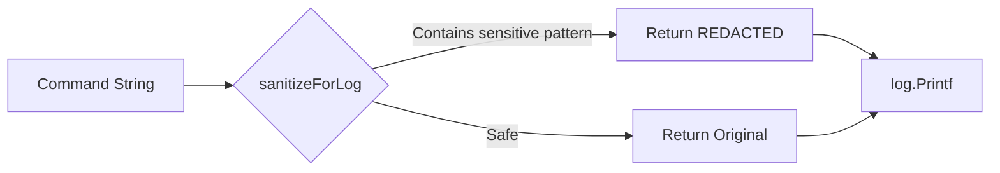

# Design Document: Security Hardening

## Overview

This design addresses three security improvements for the terraform-provider-rtx:
1. Log sanitization to prevent sensitive data exposure in debug logs
2. Warning messages for insecure SSH host key verification settings
3. Enhanced .gitignore patterns for security best practices

These changes are non-breaking and require minimal code modifications.

## Code Reuse Analysis

### Existing Components to Leverage

- **log.Printf pattern**: All logging uses standard Go `log.Printf` with `[DEBUG]` prefix
- **Config struct** (`internal/client/client.go`): Contains `SkipHostKeyCheck` and `KnownHostsFile` fields
- **ssh_dialer.go**: Contains `getHostKeyCallback()` method where warnings will be added

### Integration Points

- **Command execution**: `simple_executor.go:33`, `working_session.go:108`, and ~50+ service files log commands
- **SSH connection**: `ssh_dialer.go` handles host key verification setup
- **Provider configuration**: Provider schema already has `skip_host_key_check` attribute

## Architecture

### Log Sanitization Flow



### Component Structure

```
internal/client/
├── log_sanitizer.go      # NEW: Sanitization utility
├── simple_executor.go    # MODIFY: Use sanitizer
├── working_session.go    # MODIFY: Use sanitizer
├── ssh_dialer.go         # MODIFY: Add warnings
└── *_service.go          # MODIFY: Use sanitizer (via helper)
```

## Components and Interfaces

### Component 1: Log Sanitizer (`internal/client/log_sanitizer.go`)

- **Purpose:** Centralized utility to redact sensitive data from log messages
- **Interfaces:**
  ```go
  // SanitizeCommandForLog redacts sensitive patterns from command strings
  func SanitizeCommandForLog(cmd string) string

  // LogCommand logs a command with automatic sanitization
  func LogCommand(prefix, cmd string)
  ```
- **Dependencies:** Standard library only (`strings`, `log`)
- **Reuses:** None (new utility)

### Component 2: SSH Warning Logger (`internal/client/ssh_dialer.go` modification)

- **Purpose:** Warn users about insecure SSH host key verification settings
- **Interfaces:** No new public interfaces; modifies `getHostKeyCallback()` internal behavior
- **Dependencies:** Existing `Config` struct
- **Reuses:** Existing `getHostKeyCallback()` method

### Component 3: .gitignore Enhancement

- **Purpose:** Exclude sensitive file patterns from version control
- **Interfaces:** N/A (configuration file)
- **Dependencies:** None
- **Reuses:** Existing .gitignore patterns

## Data Models

### Sensitive Pattern Configuration

```go
// sensitivePatterns defines patterns that indicate sensitive data
var sensitivePatterns = []string{
    "password",
    "pre-shared-key",
    "secret",
    "community",  // SNMP community strings
}
```

No new data models required. All changes operate on existing string data.

## Error Handling

### Error Scenarios

1. **Invalid input to sanitizer**
   - **Handling:** Return original string (fail-open for logging)
   - **User Impact:** Log message appears unchanged; no security benefit but no crash

2. **Empty command string**
   - **Handling:** Return empty string
   - **User Impact:** Empty log entry (acceptable)

### Warning Message Format

```
[WARN] SSH host key verification is disabled (skip_host_key_check=true).
This makes the connection vulnerable to man-in-the-middle attacks.
Consider using 'known_hosts_file' or 'host_key' for production environments.
```

## Testing Strategy

### Unit Testing

**File: `internal/client/log_sanitizer_test.go`**

| Test Case | Input | Expected Output |
|-----------|-------|-----------------|
| Password command | `login password secret123` | `[REDACTED - contains sensitive data]` |
| Pre-shared key | `ipsec pre-shared-key text mykey` | `[REDACTED - contains sensitive data]` |
| Case insensitive | `LOGIN PASSWORD test` | `[REDACTED - contains sensitive data]` |
| Safe command | `ip lan1 address 192.168.1.1/24` | `ip lan1 address 192.168.1.1/24` |
| Empty string | `` | `` |
| Partial match | `password` (keyword only) | `[REDACTED - contains sensitive data]` |

### Integration Testing

- Verify debug logs do not contain sensitive data when `TF_LOG=DEBUG`
- Verify warning messages appear when `skip_host_key_check=true`
- Verify no warnings when `known_hosts_file` is configured

### Manual Testing

1. Run provider with `TF_LOG=DEBUG` and create a resource with password
2. Grep logs for `password`, `pre-shared-key`, `secret` - should find only `[REDACTED]`
3. Configure provider without host key verification and check for warning

## Implementation Notes

### Minimal Change Approach

To minimize risk and scope, we will:

1. **Create a single helper function** instead of modifying every log call
2. **Add warnings only in one location** (`getHostKeyCallback`)
3. **Keep existing log structure** - only wrap command strings

### Files to Modify

| File | Change Type | Description |
|------|-------------|-------------|
| `internal/client/log_sanitizer.go` | CREATE | New sanitization utility |
| `internal/client/log_sanitizer_test.go` | CREATE | Unit tests |
| `internal/client/simple_executor.go` | MODIFY | Use sanitizer for command logs |
| `internal/client/working_session.go` | MODIFY | Use sanitizer for command logs |
| `internal/client/ssh_dialer.go` | MODIFY | Add warning logs |
| `.gitignore` | MODIFY | Add sensitive file patterns |

### Service Files Strategy

Rather than modifying 50+ service files, we can:
1. First implement sanitizer for core files (`simple_executor.go`, `working_session.go`)
2. Service files log through these executors, so they will be covered
3. If direct logging exists in service files, add as follow-up task

## Security Considerations

- Sanitization uses case-insensitive matching to catch `PASSWORD`, `Password`, etc.
- Pattern list is extensible for future additions
- Warnings use `[WARN]` prefix to stand out in logs
- No sensitive data is logged even in error paths
