# Design Document: State Drift Fix for Access List Resources

## Overview

This design addresses persistent terraform plan diffs where Read functions don't properly preserve state for access list related attributes. The fix ensures that configuration values set by Terraform are correctly maintained in state across plan/apply cycles.

## Steering Document Alignment

### Technical Standards (tech.md)

> **Terraform State Handling**: Persist only configuration attributes in Terraform state; Do not store operational/runtime status values to avoid perpetual diffs

The access list name attributes (`access_list_ip_in`, etc.) ARE configuration attributes, not runtime status. The current bug prevents them from being persisted correctly.

### Project Structure (structure.md)

- Changes follow the existing service/resource layer separation
- Parser layer parses filter numbers; service layer handles name-to-number mapping
- Resource layer manages Terraform schema and state

## Code Reuse Analysis

### Existing Components to Leverage

- **InterfaceService**: Already has `fromParserConfig` method that needs modification
- **IPv6InterfaceService**: Already has `fromParserConfig` method that needs modification
- **EthernetFilterService**: Has `fromParserFilterToMACEntry` that needs action normalization fix
- **DiffSuppressFunc**: Terraform SDK's built-in diff suppression mechanism

### Integration Points

- **Parser Layer**: `parsers.InterfaceConfig` returns `SecureFilterIn []int` (filter numbers), not names
- **Resource Layer**: Schema expects `access_list_ip_in string` (access list names)
- **State Management**: Read functions must preserve state values that can't be derived from router

## Architecture

The key insight is that RTX routers store filter NUMBERS, while Terraform uses access list NAMES for user convenience. There's no way to reverse-lookup names from numbers. The solution is to preserve state values during Read.

```mermaid
graph TD
    subgraph "Current (Broken)"
        A1[terraform apply] --> B1[Set access_list_ip_in = 'wan-secure']
        B1 --> C1[Service: Map name to filter numbers]
        C1 --> D1[Router: Store filter numbers]
        D1 --> E1[terraform plan]
        E1 --> F1[Read: Parser returns filter numbers]
        F1 --> G1[Service: fromParserConfig sets empty string]
        G1 --> H1[State: access_list_ip_in = '' WRONG]
        H1 --> I1[Diff: '' → 'wan-secure']
    end

    subgraph "Fixed"
        A2[terraform apply] --> B2[Set access_list_ip_in = 'wan-secure']
        B2 --> C2[Service: Map name to filter numbers]
        C2 --> D2[Router: Store filter numbers]
        D2 --> E2[terraform plan]
        E2 --> F2[Read: Parser returns filter numbers]
        F2 --> G2[Resource: Preserve existing state value]
        G2 --> H2[State: access_list_ip_in = 'wan-secure' CORRECT]
        H2 --> I2[No diff]
    end
```



## Components and Interfaces

### Component 1: Interface Resource Read Logic Fix

- **Purpose:** Preserve access list name attributes during Read
- **File:** `internal/provider/resource_rtx_interface.go`
- **Change:** Don't call `d.Set()` for access list attributes when service returns empty; let state keep existing value
- **Interfaces:** No interface changes
- **Dependencies:** terraform-plugin-sdk `d.Get()` to check existing value

### Component 2: IPv6 Interface Resource Read Logic Fix

- **Purpose:** Preserve IPv6 access list name attributes during Read
- **File:** `internal/provider/resource_rtx_ipv6_interface.go`
- **Change:** Don't call `d.Set()` for access list attributes when service returns empty
- **Interfaces:** No interface changes
- **Dependencies:** terraform-plugin-sdk

### Component 3: MAC Access List Entry Normalization Fix

- **Purpose:** Fix ace_action and address field normalization issues
- **File:** `internal/client/ethernet_filter_service.go`
- **Changes:**
  1. Normalize `pass` and `pass-nolog` to consistent value
  2. Normalize `reject` and `reject-nolog` to consistent value
  3. Fix `*:*:*:*:*:*` → `*_any = true` conversion
- **Interfaces:** No interface changes
- **Dependencies:** None

### Component 4: MAC Access List DiffSuppressFunc

- **Purpose:** Suppress diffs for equivalent action values
- **File:** `internal/provider/resource_rtx_access_list_mac.go`
- **Changes:**
  1. Add `DiffSuppressFunc` to `ace_action` schema field
  2. Treat "pass" = "pass-nolog" = "permit" as equivalent
  3. Treat "reject" = "reject-nolog" = "deny" as equivalent
- **Interfaces:** No interface changes
- **Dependencies:** terraform-plugin-sdk

### Component 5: MAC Access List Address Field Handling

- **Purpose:** Fix source/destination address vs `*_any` field handling
- **File:** `internal/provider/resource_rtx_access_list_mac.go`
- **Changes:**
  1. When `source_any = true`, don't show diff for `source_address`
  2. When `destination_any = true`, don't show diff for `destination_address`
  3. Use `ConflictsWith` or `ExactlyOneOf` schema validation
- **Interfaces:** No interface changes
- **Dependencies:** terraform-plugin-sdk

## Data Models

No data model changes required. Existing models are sufficient:

### InterfaceConfig (unchanged)
```go
type InterfaceConfig struct {
    Name                    string
    AccessListIPIn          string
    AccessListIPOut         string
    AccessListIPDynamicIn   string
    AccessListIPDynamicOut  string
    AccessListMACIn         string
    AccessListMACOut        string
    // ... other fields
}
```

### AccessListMACEntry (unchanged)
```go
type AccessListMACEntry struct {
    Sequence           int
    FilterID           int
    AceAction          string
    SourceAny          bool
    SourceAddress      string
    DestinationAny     bool
    DestinationAddress string
    // ... other fields
}
```

## Error Handling

### Error Scenarios

1. **Access list not found during apply**
   - **Handling:** Return error with clear message about missing access list
   - **User Impact:** Apply fails with descriptive error

2. **Invalid filter numbers from router**
   - **Handling:** Log warning, continue with best effort
   - **User Impact:** State may be incomplete but not fail

## Testing Strategy

### Unit Testing

- Test `DiffSuppressFunc` with all action value combinations
- Test address normalization with wildcard patterns
- Test state preservation logic in mock scenarios

### Integration Testing

- Verify `terraform plan` shows no changes after `terraform apply`
- Verify import works correctly and subsequent plan shows no drift
- Test with various access list configurations

### End-to-End Testing

- Apply interface with access list bindings
- Run `terraform plan` - expect "No changes"
- Modify access list entries, apply
- Run `terraform plan` - expect "No changes"
