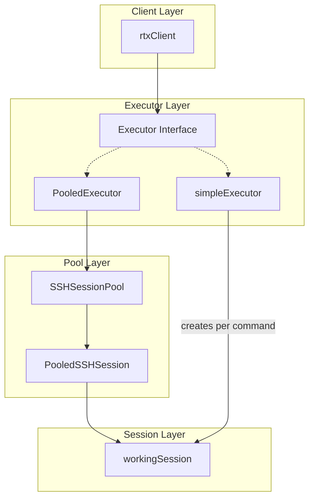
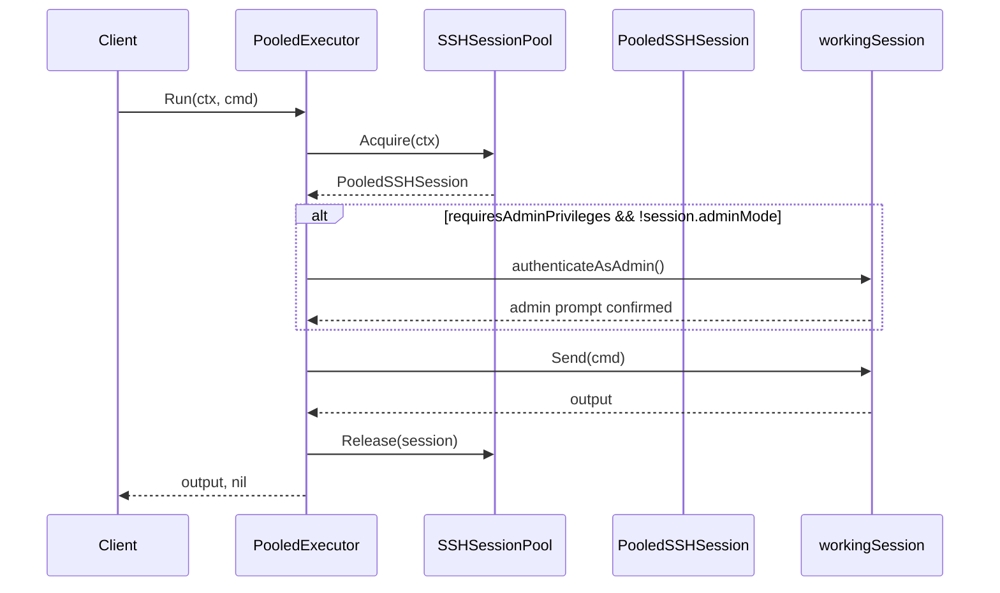
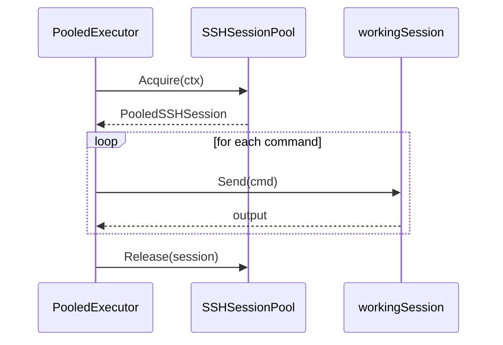

# Design Document: SSH Session Pool Integration

## Overview

This design integrates the existing `SSHSessionPool` into the executor layer by creating a new `PooledExecutor` implementation. The pool already exists in `client.go` but is not wired into the command execution path. The `PooledExecutor` will acquire sessions from the pool for command execution, eliminating redundant SSH connections that cause rate limiting errors on RTX routers.

## Steering Document Alignment

### Technical Standards (tech.md)
- Uses Zerolog for all logging (per CLAUDE.md requirements)
- Follows existing Go patterns in the codebase
- Maintains interface-based design (`Executor` interface)

### Project Structure (structure.md)
- New executor implementation in `internal/client/pooled_executor.go`
- No changes to existing package structure
- Tests alongside implementation files

## Code Reuse Analysis

### Existing Components to Leverage
- **`SSHSessionPool`**: Already implements session management, acquisition, release, and idle cleanup
- **`workingSession`**: Provides command execution via `Send()`, prompt detection, and admin mode tracking
- **`Executor` interface**: Already defined with `Run()`, `RunBatch()`, `SetAdministratorPassword()`, `SetLoginPassword()`
- **`simpleExecutor`**: Reference implementation for admin authentication patterns

### Integration Points
- **`rtxClient.sshSessionPool`**: Already created in client initialization; `PooledExecutor` will receive it as dependency
- **`rtxClient.executor`**: Change initialization to use `PooledExecutor` when pool is enabled

## Architecture

The design follows the Strategy pattern where `PooledExecutor` and `simpleExecutor` are interchangeable implementations of the `Executor` interface.



### Modular Design Principles
- **Single File Responsibility**: `pooled_executor.go` handles only pooled command execution
- **Component Isolation**: Pool management stays in `SSHSessionPool`, executor only uses pool interface
- **Dependency Injection**: `PooledExecutor` receives `SSHSessionPool` as constructor parameter

## Components and Interfaces

### PooledExecutor
- **Purpose:** Executes commands using sessions from the pool instead of creating new connections
- **File:** `internal/client/pooled_executor.go`
- **Interfaces:** Implements `Executor` interface:
  ```go
  type PooledExecutor struct {
      pool           *SSHSessionPool
      promptDetector *PromptDetector
      config         *Config
      mu             sync.Mutex
  }

  func NewPooledExecutor(pool *SSHSessionPool, promptDetector *PromptDetector, config *Config) *PooledExecutor

  func (e *PooledExecutor) Run(ctx context.Context, cmd string) ([]byte, error)
  func (e *PooledExecutor) RunBatch(ctx context.Context, cmds []string) ([]byte, error)
  func (e *PooledExecutor) SetAdministratorPassword(ctx context.Context, oldPassword, newPassword string) error
  func (e *PooledExecutor) SetLoginPassword(ctx context.Context, newPassword string) error
  ```
- **Dependencies:** `SSHSessionPool`, `PromptDetector`, `Config`
- **Reuses:** `SSHSessionPool.Acquire()`, `SSHSessionPool.Release()`, `workingSession.Send()`

### Modified rtxClient Initialization
- **Purpose:** Wire `PooledExecutor` as the default executor when pool is enabled
- **File:** `internal/client/client.go` (modification)
- **Change:** Replace `simpleExecutor` creation with `PooledExecutor` when `sshPoolEnabled=true`

## Data Models

### Session State Tracking
The pool already tracks session state via `PooledSSHSession`. No new data models needed.

```go
// Existing in ssh_session_pool.go
type PooledSSHSession struct {
    session     *workingSession
    poolID      string
    lastUsed    time.Time
    useCount    int64
    initialized bool
}
```

### Admin Mode State
Admin mode is already tracked per `workingSession` via `adminMode` field. The design reuses this existing mechanism.

## Command Execution Flow

### Standard Command (Run)


### Batch Commands (RunBatch)
For batch commands, acquire once, execute all commands sequentially, then release:



### Password Change Operations
Password operations require interactive prompts. These use the same pooled session with admin authentication:

1. Acquire session from pool
2. Authenticate as administrator (if needed)
3. Execute interactive password change sequence
4. Release session back to pool

## Error Handling

### Error Scenarios

1. **Pool Exhausted (Acquire Timeout)**
   - **Handling:** `Acquire()` returns error after `AcquireTimeout` (default 30s)
   - **User Impact:** Terraform operation fails with clear message: "failed to acquire SSH session: timeout waiting for available session"
   - **Recovery:** Automatic retry via Terraform's retry logic

2. **Session Failure During Command**
   - **Handling:** Discard failed session (don't return to pool), retry with new session
   - **User Impact:** Transparent retry, operation succeeds if second attempt works
   - **Implementation:**
     ```go
     output, err := e.executeWithRetry(ctx, cmd, maxRetries)
     if err != nil {
         // Log and return error
     }
     ```

3. **Admin Authentication Failure**
   - **Handling:** Release session, return authentication error
   - **User Impact:** "administrator authentication failed: [reason]"
   - **Note:** Session remains in user mode, can be reused for non-admin commands

4. **SSH Client Connection Lost**
   - **Handling:** Pool detects via session health check, invalidates all sessions
   - **User Impact:** Next operation triggers reconnection
   - **Implementation:** Pool's existing health management handles this

### Retry Strategy
```go
const (
    maxRetries     = 2
    retryBaseDelay = 100 * time.Millisecond
)

func (e *PooledExecutor) executeWithRetry(ctx context.Context, cmd string, retries int) ([]byte, error) {
    var lastErr error
    for attempt := 0; attempt <= retries; attempt++ {
        session, err := e.pool.Acquire(ctx)
        if err != nil {
            return nil, fmt.Errorf("failed to acquire session: %w", err)
        }

        output, err := e.executeOnSession(ctx, session, cmd)
        if err == nil {
            e.pool.Release(session)
            return output, nil
        }

        lastErr = err
        // Don't release failed session - let pool discard it
        e.pool.Discard(session)

        if attempt < retries {
            time.Sleep(retryBaseDelay * time.Duration(attempt+1))
        }
    }
    return nil, lastErr
}
```

## Admin Mode Management

### Strategy: Lazy Authentication
Sessions start in user mode. Admin authentication happens only when needed:

1. Check if command `requiresAdminPrivileges()`
2. Check if session is already in admin mode (`session.session.adminMode`)
3. If admin needed and not in admin mode → authenticate
4. Execute command
5. **Keep session in admin mode** when returning to pool (optimization)

### Session Reuse with Admin State
```go
func (e *PooledExecutor) prepareSession(ctx context.Context, session *PooledSSHSession, needsAdmin bool) error {
    ws := session.session

    if needsAdmin && !ws.adminMode {
        if err := e.authenticateAsAdmin(ws); err != nil {
            return err
        }
        ws.SetAdminMode(true)
    }
    return nil
}
```

### Pool Release Behavior
When releasing a session:
- **Do NOT exit admin mode** - next user might need admin access
- Pool keeps session as-is (admin mode preserved)
- On pool close or idle cleanup, `workingSession.Close()` handles proper exit sequence

## Backward Compatibility

### Configuration Flag
Pool is enabled by default (existing behavior in `client.go`):
```go
sshPoolEnabled := config.SSHPoolEnabled || (config.SSHPoolMaxSessions == 0 && config.SSHPoolIdleTimeout == "")
```

### Fallback to simpleExecutor
When pool is disabled:
```go
if sshPoolEnabled {
    c.executor = NewPooledExecutor(c.sshSessionPool, c.promptDetector, c.config)
} else {
    c.executor = NewSimpleExecutor(sshConfig, addr, c.promptDetector, c.config)
}
```

### Error Message Consistency
All error messages follow existing patterns:
- "failed to execute command: [reason]"
- "administrator authentication failed: [reason]"
- "failed to acquire SSH session: [reason]"

## Testing Strategy

### Unit Testing
- **Mock SSHSessionPool:** Test `PooledExecutor` with mock pool that returns controlled sessions
- **Test scenarios:**
  - Successful command execution
  - Admin authentication flow
  - Pool exhaustion handling
  - Session failure and retry
  - Batch command execution

### Integration Testing
- **Test with real pool:** Verify session reuse by counting pool statistics
- **Test scenarios:**
  - Multiple commands share same session
  - Concurrent command execution
  - Admin mode persistence across commands

### End-to-End Testing
- **Terraform acceptance tests:**
  - Create/read/update/delete resource with pooled executor
  - Verify no connection errors with 10+ resources
  - Measure execution time improvement

### Test File Structure
```
internal/client/
├── pooled_executor.go
├── pooled_executor_test.go
├── mock_session_pool_test.go  // Test helper
```

## Implementation Phases

### Phase 1: Core PooledExecutor
1. Create `PooledExecutor` struct with `Run()` method
2. Implement session acquisition and release
3. Add basic error handling

### Phase 2: Admin Mode Support
1. Implement `prepareSession()` with admin authentication
2. Port `authenticateAsAdmin()` from `simpleExecutor`
3. Add admin mode state tracking

### Phase 3: Advanced Features
1. Implement `RunBatch()` for efficient batch execution
2. Add retry logic with exponential backoff
3. Implement `SetAdministratorPassword()` and `SetLoginPassword()`

### Phase 4: Integration & Testing
1. Wire `PooledExecutor` into `rtxClient`
2. Add comprehensive unit tests
3. Run acceptance tests to verify reliability

## Performance Considerations

- **Session Acquisition:** < 10ms when sessions available (existing pool behavior)
- **Admin Authentication:** ~100-200ms (one-time per session)
- **Connection Reuse:** Eliminates ~500ms per command (SSH handshake overhead)
- **Expected Improvement:** 50%+ faster for large configurations (60+ resources)
