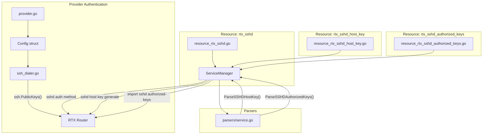

# Design Document: SSHD Public Key Authentication

## Overview

This feature adds comprehensive SSH public key authentication support for Yamaha RTX routers at two levels:

1. **Provider Level**: Enable the Terraform provider to authenticate to RTX routers using SSH keys
2. **Resource Level**: Manage SSH public key settings on RTX routers (host keys, authorized keys, auth methods)

## Steering Document Alignment

### Technical Standards (tech.md)

- Uses existing `golang.org/x/crypto/ssh` library for public key authentication
- Follows the parser registry pattern for new SSHD parsers
- Maintains stateless communication model (each operation uses pooled SSH connections)
- Uses Zerolog for all logging

### Project Structure (structure.md)

- New files follow naming conventions: `resource_rtx_<feature>.go`, `<feature>_service.go`
- Extends existing `ServiceManager` for SSHD operations
- Adds parser methods to existing `parsers/service.go`
- Provider schema extensions in `provider.go`

## Code Reuse Analysis

### Existing Components to Leverage

- **`ssh_dialer.go`**: Extend to support public key authentication methods
- **`ServiceManager`**: Extend with host key and authorized keys methods
- **`resource_rtx_sshd.go`**: Extend schema with `auth_method` attribute
- **`parsers/service.go`**: Extend with host key and authorized keys parsers
- **`SSHDConfig` struct**: Extend with `AuthMethod` field

### Integration Points

- **Provider Configuration**: Add `private_key`, `private_key_file`, `private_key_passphrase` to provider schema
- **Config struct**: Add corresponding fields for SSH key authentication
- **SSH Connection**: Modify `sshDialer.Dial()` to use public key auth when configured

## Architecture



## Components and Interfaces

### Component 1: Provider SSH Key Authentication

**Purpose:** Enable Terraform provider to connect to RTX routers using SSH public key authentication

**Files to Modify:**
- `internal/provider/provider.go` - Add schema attributes
- `internal/client/interfaces.go` - Extend Config struct
- `internal/client/ssh_dialer.go` - Add public key auth methods

**Config Struct Extension:**
```go
type Config struct {
    // ... existing fields ...

    // SSH Public Key Authentication
    PrivateKey           string // PEM-encoded private key content
    PrivateKeyFile       string // Path to private key file
    PrivateKeyPassphrase string // Passphrase for encrypted private key
}
```

**ssh_dialer.go Changes:**
```go
func (d *sshDialer) Dial(ctx context.Context, host string, config *Config) (Session, error) {
    authMethods := d.buildAuthMethods(config)

    sshConfig := &ssh.ClientConfig{
        User:            config.Username,
        Auth:            authMethods,
        HostKeyCallback: hostKeyCallback,
        Timeout:         time.Duration(config.Timeout) * time.Second,
    }
    // ... rest of dial logic
}

func (d *sshDialer) buildAuthMethods(config *Config) []ssh.AuthMethod {
    var methods []ssh.AuthMethod

    // 1. Try SSH agent first (if no explicit key provided)
    if config.PrivateKey == "" && config.PrivateKeyFile == "" {
        if agentAuth := d.trySSHAgent(); agentAuth != nil {
            methods = append(methods, agentAuth)
        }
    }

    // 2. Try explicit private key
    if signer := d.loadPrivateKey(config); signer != nil {
        methods = append(methods, ssh.PublicKeys(signer))
    }

    // 3. Fallback to password
    if config.Password != "" {
        methods = append(methods, ssh.Password(config.Password))
        methods = append(methods, ssh.KeyboardInteractive(...))
    }

    return methods
}

func (d *sshDialer) loadPrivateKey(config *Config) ssh.Signer {
    var keyBytes []byte
    if config.PrivateKey != "" {
        keyBytes = []byte(config.PrivateKey)
    } else if config.PrivateKeyFile != "" {
        keyBytes, _ = os.ReadFile(expandPath(config.PrivateKeyFile))
    }

    if config.PrivateKeyPassphrase != "" {
        signer, _ := ssh.ParsePrivateKeyWithPassphrase(keyBytes, []byte(config.PrivateKeyPassphrase))
        return signer
    }
    signer, _ := ssh.ParsePrivateKey(keyBytes)
    return signer
}

func (d *sshDialer) trySSHAgent() ssh.AuthMethod {
    socket := os.Getenv("SSH_AUTH_SOCK")
    if socket == "" {
        return nil
    }
    conn, err := net.Dial("unix", socket)
    if err != nil {
        return nil
    }
    agentClient := agent.NewClient(conn)
    return ssh.PublicKeysCallback(agentClient.Signers)
}
```

**Provider Schema Addition:**
```go
"private_key": {
    Type:        schema.TypeString,
    Optional:    true,
    Sensitive:   true,
    DefaultFunc: schema.EnvDefaultFunc("RTX_PRIVATE_KEY", nil),
    Description: "SSH private key content (PEM format). Can be set with RTX_PRIVATE_KEY environment variable.",
},
"private_key_file": {
    Type:          schema.TypeString,
    Optional:      true,
    ConflictsWith: []string{"private_key"},
    DefaultFunc:   schema.EnvDefaultFunc("RTX_PRIVATE_KEY_FILE", nil),
    Description:   "Path to SSH private key file. Can be set with RTX_PRIVATE_KEY_FILE environment variable.",
},
"private_key_passphrase": {
    Type:        schema.TypeString,
    Optional:    true,
    Sensitive:   true,
    DefaultFunc: schema.EnvDefaultFunc("RTX_PRIVATE_KEY_PASSPHRASE", nil),
    Description: "Passphrase for encrypted private key. Can be set with RTX_PRIVATE_KEY_PASSPHRASE environment variable.",
},
```

### Component 2: rtx_sshd Auth Method Extension

**Purpose:** Add `auth_method` attribute to existing rtx_sshd resource

**Files to Modify:**
- `internal/provider/resource_rtx_sshd.go` - Add schema attribute
- `internal/client/interfaces.go` - Extend SSHDConfig struct
- `internal/client/service_manager.go` - Add auth method commands
- `internal/rtx/parsers/service.go` - Parse auth method from config

**SSHDConfig Extension:**
```go
type SSHDConfig struct {
    Enabled    bool
    Hosts      []string
    HostKey    string
    AuthMethod string // "password", "publickey", "any" (default)
}
```

**RTX Commands:**
```
sshd auth method password   # Password only
sshd auth method publickey  # Public key only
no sshd auth method         # Both (default)
```

### Component 3: rtx_sshd_host_key Resource

**Purpose:** Manage SSH host key generation on RTX routers

**Files to Create:**
- `internal/provider/resource_rtx_sshd_host_key.go`

**Terraform Schema:**
```go
func resourceRTXSSHDHostKey() *schema.Resource {
    return &schema.Resource{
        Schema: map[string]*schema.Schema{
            "fingerprint": {
                Type:        schema.TypeString,
                Computed:    true,
                Description: "SSH host key fingerprint (SHA256)",
            },
            "algorithm": {
                Type:        schema.TypeString,
                Computed:    true,
                Description: "Host key algorithm (e.g., ssh-rsa)",
            },
        },
    }
}
```

**Behavior:**
- **Create**: Check if host key exists first; only generate if none exists
- **Read**: Parse `show status sshd` for fingerprint
- **Update**: No-op (host key attributes are all Computed)
- **Delete**: No-op (host keys persist for security)
- **Import**: Read existing host key info

**RTX Commands:**
```
sshd host key generate      # Generate host key
show status sshd            # Show host key fingerprint
```

**Existing Server Handling (First Apply):**

When `terraform apply` is run on an RTX router that already has a host key configured:

```
┌─────────────────────────────────────────────────────────────────┐
│ First terraform apply on existing RTX server                    │
├─────────────────────────────────────────────────────────────────┤
│ 1. Create is called                                             │
│ 2. Check: Does host key exist? (show status sshd)               │
│    ├─ YES: Do NOT regenerate. Read existing key info.           │
│    │       Set fingerprint/algorithm in state.                  │
│    │       Return success (idempotent).                         │
│    └─ NO:  Execute "sshd host key generate"                     │
│            Read new key info. Set in state.                     │
└─────────────────────────────────────────────────────────────────┘
```

**Implementation Logic:**
```go
func resourceRTXSSHDHostKeyCreate(ctx context.Context, d *schema.ResourceData, meta interface{}) diag.Diagnostics {
    client := meta.(*apiClient)

    // Check if host key already exists
    hostKeyInfo, err := client.client.GetSSHDHostKey(ctx)
    if err != nil {
        return diag.Errorf("Failed to check host key status: %v", err)
    }

    if hostKeyInfo.Fingerprint == "" {
        // No existing key - generate new one
        if err := client.client.GenerateSSHDHostKey(ctx); err != nil {
            return diag.Errorf("Failed to generate host key: %v", err)
        }
        // Re-read to get the new key info
        hostKeyInfo, err = client.client.GetSSHDHostKey(ctx)
        if err != nil {
            return diag.Errorf("Failed to read generated host key: %v", err)
        }
    }
    // else: Key already exists - just adopt it into state

    d.SetId("sshd_host_key")
    d.Set("fingerprint", hostKeyInfo.Fingerprint)
    d.Set("algorithm", hostKeyInfo.Algorithm)

    return nil
}
```

**Why This Design:**
- Prevents accidental host key regeneration on existing servers
- Allows Terraform to "adopt" existing infrastructure
- Maintains SSH client trust (known_hosts won't break)
- Idempotent: running apply multiple times has no side effects

### Component 4: rtx_sshd_authorized_keys Resource

**Purpose:** Manage SSH authorized keys for RTX router users

**Files to Create:**
- `internal/provider/resource_rtx_sshd_authorized_keys.go`

**Terraform Schema:**
```go
func resourceRTXSSHDAuthorizedKeys() *schema.Resource {
    return &schema.Resource{
        Schema: map[string]*schema.Schema{
            "username": {
                Type:        schema.TypeString,
                Required:    true,
                ForceNew:    true,
                Description: "Username to manage authorized keys for",
            },
            "keys": {
                Type:     schema.TypeList,
                Required: true,
                Elem: &schema.Schema{
                    Type: schema.TypeString,
                },
                Description: "List of SSH public keys in OpenSSH format",
            },
        },
    }
}
```

**Behavior:**
- **Create**: Register all keys via `import sshd authorized-keys`
- **Read**: Parse `show sshd authorized-keys <user>` for key list
- **Update**: Delete all keys, then re-register desired keys (RTX limitation)
- **Delete**: Execute `delete /ssh/authorized_keys/<user>`

**Service Methods:**
```go
// GetSSHDAuthorizedKeys retrieves authorized keys for a user
func (s *ServiceManager) GetSSHDAuthorizedKeys(ctx context.Context, username string) ([]SSHAuthorizedKey, error)

// SetSSHDAuthorizedKeys sets all authorized keys for a user (replaces existing)
func (s *ServiceManager) SetSSHDAuthorizedKeys(ctx context.Context, username string, keys []string) error

// DeleteSSHDAuthorizedKeys removes all authorized keys for a user
func (s *ServiceManager) DeleteSSHDAuthorizedKeys(ctx context.Context, username string) error
```

**RTX Commands:**
```
import sshd authorized-keys <user>    # Interactive key input
show sshd authorized-keys <user>      # List keys (fingerprints)
delete /ssh/authorized_keys/<user>    # Delete all keys
```

**Key Import Challenge:**
The `import sshd authorized-keys` command is interactive. Implementation options:
1. Use `executor.Run()` with key content piped as input
2. Send key followed by newline and detect prompt return

## Data Models

### SSHAuthorizedKey
```go
type SSHAuthorizedKey struct {
    Type        string // e.g., "ssh-ed25519", "ssh-rsa"
    Fingerprint string // SHA256 fingerprint
    Comment     string // Key comment (e.g., "user@host")
}
```

### SSHHostKeyInfo
```go
type SSHHostKeyInfo struct {
    Fingerprint string // SHA256 fingerprint
    Algorithm   string // Key algorithm
    Generated   bool   // Whether key exists
}
```

## Error Handling

### Error Scenarios

1. **Private key file not found**
   - **Handling:** Return clear error with file path
   - **User Impact:** Terraform plan/apply fails with actionable message

2. **Invalid private key format**
   - **Handling:** Return error indicating PEM format expected
   - **User Impact:** User corrects key format

3. **Passphrase required but not provided**
   - **Handling:** Return error indicating encrypted key needs passphrase
   - **User Impact:** User provides passphrase

4. **SSH agent not available**
   - **Handling:** Fall back to password auth silently if available
   - **User Impact:** None if password is configured

5. **Host key already exists (for rtx_sshd_host_key)**
   - **Handling:** Read existing key, don't regenerate
   - **User Impact:** Idempotent behavior

6. **Invalid public key format (for authorized_keys)**
   - **Handling:** Return validation error before sending to router
   - **User Impact:** Clear error message about key format

7. **User not found (for authorized_keys)**
   - **Handling:** Return error from RTX command
   - **User Impact:** User must create login user first

## Testing Strategy

### Unit Testing

**Provider Authentication:**
- Test `loadPrivateKey()` with various key formats (RSA, ED25519, encrypted)
- Test `trySSHAgent()` with mocked agent socket
- Test `buildAuthMethods()` priority order

**Resource Logic:**
- Test `rtx_sshd_authorized_keys` key list diffing
- Test `rtx_sshd_host_key` idempotent behavior

### Integration Testing

**Provider Authentication:**
- Test SSH connection with key file
- Test SSH connection with key content
- Test SSH connection with SSH agent
- Test fallback to password when key auth fails

**Resources:**
- Test `rtx_sshd` with `auth_method` changes
- Test `rtx_sshd_host_key` create/import cycle
- Test `rtx_sshd_authorized_keys` full CRUD cycle
- Test key removal triggers full re-registration

### Acceptance Testing

- End-to-end test with real RTX router
- Test provider authentication with public key
- Test resource management of authorized keys
