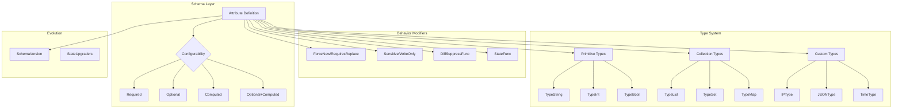

# Design Document: Terraform Schema Design Patterns

## Overview

This document describes the technical design for implementing comprehensive schema design patterns in the Terraform provider for RTX routers. These patterns establish consistent approaches to attribute configurability, sensitive data handling, immutable fields, diff suppression, custom types, and schema evolution.

## Steering Document Alignment

### Technical Standards (tech.md)

- **SDK**: terraform-plugin-sdk/v2 v2.37.0 (with notes for plugin-framework migration)
- **Go Version**: 1.23 with proper nil/pointer handling
- **Logging**: Zerolog for debugging schema issues
- **Code Style**: golangci-lint compliance

### Project Structure (structure.md)

Implementation will follow the established structure:
- Schema definitions in `internal/provider/resource_*.go`
- Custom types in `internal/provider/types/`
- Validators in `internal/provider/validators/`
- State upgraders in `internal/provider/state_upgraders/`

## Code Reuse Analysis

### Existing Components to Leverage

- **terraform-plugin-sdk/v2/helper/schema**: Core schema definitions
- **terraform-plugin-sdk/v2/helper/validation**: Built-in validators
- **field_helpers.go**: Existing field extraction utilities from optional-field-preservation spec
- **Parsers**: Value normalization in parsers package

### Integration Points

- **Provider resources**: All schema definitions
- **Client interfaces**: Pointer types for optional fields
- **Command builders**: Value formatting and normalization

## Architecture



## Components and Interfaces

### Component 1: Attribute Configurability Patterns

- **Purpose:** Define when to use each attribute configuration
- **Location:** Documentation and code patterns in all resource files
- **Patterns:**

```go
// Pattern A: Required - Must be provided by user
"username": {
    Type:        schema.TypeString,
    Required:    true,
    Description: "Username for the admin user",
},

// Pattern B: Optional - User may provide, no default
"description": {
    Type:        schema.TypeString,
    Optional:    true,
    Description: "Optional description",
},

// Pattern C: Computed - Read-only, provider fills
"created_at": {
    Type:        schema.TypeString,
    Computed:    true,
    Description: "Timestamp when resource was created",
},

// Pattern D: Optional+Computed - User may override API default
"administrator": {
    Type:        schema.TypeBool,
    Optional:    true,
    Computed:    true,
    Description: "Whether user has admin privileges",
},
```

### Component 2: WriteOnly/Sensitive Handler

- **Purpose:** Handle credentials without storing in state
- **Location:** `internal/provider/schema_helpers.go`
- **Interfaces:**

```go
// WriteOnlyStringSchema returns a schema for write-only string fields (SDK v2)
// Note: True WriteOnly requires plugin-framework; this is best-effort for SDK v2
func WriteOnlyStringSchema(description string) *schema.Schema {
    return &schema.Schema{
        Type:        schema.TypeString,
        Optional:    true,
        Sensitive:   true,
        Description: description,
        // In SDK v2, we can't truly make it write-only
        // Best practice: don't read back in Read function
    }
}

// SensitiveStringSchema returns a schema for sensitive but readable fields
func SensitiveStringSchema(description string, required bool) *schema.Schema {
    return &schema.Schema{
        Type:        schema.TypeString,
        Required:    required,
        Optional:    !required,
        Sensitive:   true,
        Description: description,
    }
}
```

### Component 3: RequiresReplace Patterns

- **Purpose:** Mark immutable fields that force recreation
- **Location:** Resource schema definitions
- **Patterns:**

```go
// Pattern: Immutable identifier
"username": {
    Type:        schema.TypeString,
    Required:    true,
    ForceNew:    true,  // SDK v2 way
    Description: "Username (cannot be changed after creation)",
},

// Pattern: Conditional replacement (plugin-framework prep)
// In SDK v2, use CustomizeDiff for conditional ForceNew
func resourceAdminUserCustomizeDiff(ctx context.Context, d *schema.ResourceDiff, meta interface{}) error {
    // If username_type changes from "local" to "remote", force replacement
    if d.HasChange("username_type") {
        old, new := d.GetChange("username_type")
        if old.(string) == "local" && new.(string) == "remote" {
            d.ForceNew("username_type")
        }
    }
    return nil
}
```

### Component 4: DiffSuppressFunc Library

- **Purpose:** Suppress irrelevant diffs for semantic equality
- **Location:** `internal/provider/diff_suppress.go`
- **Interfaces:**

```go
// SuppressCaseDiff ignores case differences
func SuppressCaseDiff(k, old, new string, d *schema.ResourceData) bool {
    return strings.EqualFold(old, new)
}

// SuppressWhitespaceDiff ignores leading/trailing whitespace
func SuppressWhitespaceDiff(k, old, new string, d *schema.ResourceData) bool {
    return strings.TrimSpace(old) == strings.TrimSpace(new)
}

// SuppressJSONDiff compares JSON semantically
func SuppressJSONDiff(k, old, new string, d *schema.ResourceData) bool {
    var oldJSON, newJSON interface{}
    if err := json.Unmarshal([]byte(old), &oldJSON); err != nil {
        return false
    }
    if err := json.Unmarshal([]byte(new), &newJSON); err != nil {
        return false
    }
    return reflect.DeepEqual(oldJSON, newJSON)
}

// SuppressEquivalentIPDiff compares IP addresses accounting for format
func SuppressEquivalentIPDiff(k, old, new string, d *schema.ResourceData) bool {
    oldIP := net.ParseIP(old)
    newIP := net.ParseIP(new)
    if oldIP == nil || newIP == nil {
        return old == new
    }
    return oldIP.Equal(newIP)
}
```

### Component 5: Custom Types (Framework Migration Prep)

- **Purpose:** Define domain-specific types with validation and equality
- **Location:** `internal/provider/types/`
- **Note:** SDK v2 doesn't support custom types directly; use StateFunc + DiffSuppressFunc

```go
// For SDK v2: Normalize in StateFunc, suppress in DiffSuppressFunc
"ip_address": {
    Type:             schema.TypeString,
    Optional:         true,
    StateFunc:        normalizeIPAddress,
    DiffSuppressFunc: SuppressEquivalentIPDiff,
    ValidateFunc:     validation.IsIPAddress,
    Description:      "IP address in any valid format",
},

// normalizeIPAddress converts IP to canonical form
func normalizeIPAddress(val interface{}) string {
    ip := net.ParseIP(val.(string))
    if ip == nil {
        return val.(string)
    }
    // Return canonical IPv4 or IPv6 form
    if ip4 := ip.To4(); ip4 != nil {
        return ip4.String()
    }
    return ip.String()
}
```

### Component 6: Nested Block Patterns

- **Purpose:** Define consistent patterns for nested structures
- **Location:** Resource schema definitions
- **Patterns:**

```go
// Pattern: List (ordered, duplicates allowed)
"filter_rules": {
    Type:     schema.TypeList,
    Optional: true,
    Elem: &schema.Resource{
        Schema: map[string]*schema.Schema{
            "id": {
                Type:     schema.TypeInt,
                Required: true,
            },
            "action": {
                Type:     schema.TypeString,
                Required: true,
            },
            "protocol": {
                Type:     schema.TypeString,
                Optional: true,
                Computed: true,
            },
        },
    },
},

// Pattern: Set (unordered, unique by hash)
"allowed_hosts": {
    Type:     schema.TypeSet,
    Optional: true,
    Elem: &schema.Schema{
        Type: schema.TypeString,
    },
},

// Pattern: Single nested block (MaxItems=1)
"timeouts": {
    Type:     schema.TypeList,
    Optional: true,
    MaxItems: 1,
    Elem: &schema.Resource{
        Schema: map[string]*schema.Schema{
            "create": {Type: schema.TypeString, Optional: true},
            "update": {Type: schema.TypeString, Optional: true},
            "delete": {Type: schema.TypeString, Optional: true},
        },
    },
},
```

### Component 7: Zero Value Handling

- **Purpose:** Distinguish between unset and explicitly zero
- **Location:** Resource CRUD functions using field_helpers.go
- **Pattern:**

```go
// Using GetOk to check if value was set
func resourceUpdate(ctx context.Context, d *schema.ResourceData, meta interface{}) diag.Diagnostics {
    // Check if user explicitly set the value
    if v, ok := d.GetOk("timeout"); ok {
        // User set a value (could be 0 if TypeInt allows)
        config.Timeout = v.(int)
    } else {
        // User did not set - preserve existing or use default
        // d.Get("timeout") returns state value due to Optional+Computed
        config.Timeout = d.Get("timeout").(int)
    }
}

// For boolean fields where false is meaningful
if v, ok := d.GetOkExists("enabled"); ok {
    // User explicitly set true or false
    config.Enabled = v.(bool)
}
```

### Component 8: State Upgraders

- **Purpose:** Handle schema version migrations
- **Location:** `internal/provider/state_upgraders/`
- **Interfaces:**

```go
// ResourceAdminUserV0 returns the V0 schema for state upgrade
func ResourceAdminUserV0() *schema.Resource {
    return &schema.Resource{
        Schema: map[string]*schema.Schema{
            "name": {  // Old field name
                Type:     schema.TypeString,
                Required: true,
            },
        },
    }
}

// StateUpgradeAdminUserV0 upgrades from V0 to V1
func StateUpgradeAdminUserV0(ctx context.Context, rawState map[string]interface{}, meta interface{}) (map[string]interface{}, error) {
    if rawState == nil {
        return nil, nil
    }

    // Rename "name" to "username"
    if v, ok := rawState["name"]; ok {
        rawState["username"] = v
        delete(rawState, "name")
    }

    return rawState, nil
}

// Resource definition with StateUpgraders
func resourceAdminUser() *schema.Resource {
    return &schema.Resource{
        // ... CRUD functions ...
        SchemaVersion: 1,
        StateUpgraders: []schema.StateUpgrader{
            {
                Version: 0,
                Type:    ResourceAdminUserV0().CoreConfigSchema().ImpliedType(),
                Upgrade: StateUpgradeAdminUserV0,
            },
        },
        Schema: currentSchema,
    }
}
```

## Data Models

### Decision Tree for Attribute Configuration

```
Is the value always provided by the user?
├── YES → Required: true
└── NO
    ├── Is the value ever provided by the user?
    │   ├── NO → Computed: true (read-only)
    │   └── YES
    │       ├── Can API/router provide a default?
    │       │   ├── YES → Optional: true, Computed: true
    │       │   └── NO → Optional: true
    │       └── Is change immutable after create?
    │           ├── YES → Add ForceNew: true
    │           └── NO → (no additional flag)
    └── Is it sensitive (password, key)?
        ├── YES → Add Sensitive: true
        └── NO → (no additional flag)
```

### Schema Pattern Reference

| Use Case | Required | Optional | Computed | ForceNew | Sensitive |
|----------|----------|----------|----------|----------|-----------|
| User must specify | ✓ | | | | |
| User may specify, no default | | ✓ | | | |
| Read-only from API | | | ✓ | | |
| User may override API default | | ✓ | ✓ | | |
| Immutable identifier | ✓ | | | ✓ | |
| Password field | | ✓ | | | ✓ |
| Generated ID | | | ✓ | | |

## Error Handling

### Error Scenarios

1. **Invalid Attribute Combination**
   - **Handling:** Terraform SDK validates at init
   - **User Impact:** Provider fails to load with clear error

2. **State Upgrade Failure**
   - **Handling:** Return error from StateUpgrader
   - **User Impact:** terraform apply fails, state preserved

3. **DiffSuppressFunc Panic**
   - **Handling:** Wrap in recover, log error, return false
   - **User Impact:** Diff shown (safe fallback)

4. **Zero Value Misinterpretation**
   - **Handling:** Use GetOk/GetOkExists appropriately
   - **User Impact:** Prevented by proper implementation

## Testing Strategy

### Unit Testing

- Test DiffSuppressFunc with various inputs
- Test StateUpgraders with old state formats
- Test StateFunc normalization
- Test validation functions

### Integration Testing

- Test schema behavior in acceptance tests
- Verify ForceNew triggers recreation
- Verify Sensitive fields are masked
- Verify state upgrades across versions

## Migration Notes for terraform-plugin-framework

When migrating to terraform-plugin-framework:

| SDK v2 | Plugin Framework |
|--------|------------------|
| `ForceNew: true` | `RequiresReplace()` plan modifier |
| `DiffSuppressFunc` | Custom type with `SemanticEquals()` |
| `StateFunc` | Custom type with normalization in `ValueFromTerraform()` |
| `Sensitive: true` | `Sensitive: true` (same) |
| `GetOk()` | `IsNull()` / `IsUnknown()` |
| N/A | `UseStateForUnknown()` plan modifier |
| N/A | `WriteOnly: true` |

## Security Considerations

- Never log Sensitive field values
- Validate all user inputs before use
- Use Sensitive for any credential fields
- Consider WriteOnly for passwords when migrating to framework
