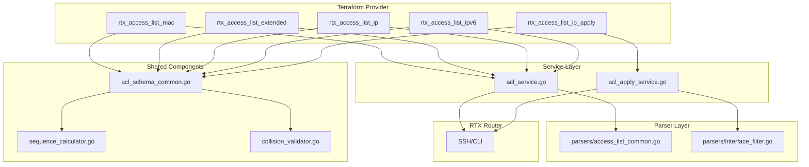

# Design Document: Unified ACL Apply Design

## Overview

This design document describes the technical implementation of the unified ACL pattern across all ACL types in the Terraform RTX provider. The implementation introduces:

1. A common ACL schema with `name`, `sequence_start`, `sequence_step`, `entry`, and `apply` attributes
2. Automatic sequence calculation based on entry definition order
3. Multiple `apply` blocks for interface binding
4. Sequence collision detection at Plan and Apply time
5. Removal of ACL attributes from interface resources

## Steering Document Alignment

### Technical Standards (tech.md)

- **Language**: Go 1.23 with terraform-plugin-sdk/v2
- **Logging**: Zerolog for structured logging
- **SSH Communication**: Existing SSH client infrastructure via `internal/client`
- **Parser Registry**: Extend existing parser pattern in `internal/rtx/parsers`

### Project Structure (structure.md)

Following the established patterns:
- Resources: `internal/provider/resource_rtx_*.go`
- Services: `internal/client/*_service.go`
- Parsers: `internal/rtx/parsers/*.go`
- Tests: `*_test.go` alongside implementation files

## Code Reuse Analysis

### Existing Components to Leverage

- **`resource_rtx_access_list_mac.go`**: Reference implementation for `apply` block pattern
- **`ethernet_filter_service.go`**: MAC filter service with apply logic to extend
- **`ip_filter_service.go`**: IP filter service to extend with apply logic
- **`parsers/access_list_*.go`**: Existing parsers to extend for group-based parsing
- **`interfaces.go`**: Interface configuration structures (to remove ACL attributes)

### Integration Points

- **RTXClient**: Add unified ACL service methods
- **SSH Session**: Reuse existing command execution infrastructure
- **SFTP Cache**: Leverage for efficient state reading

## Architecture



## Components and Interfaces

### Component 1: ACL Schema Common (`acl_schema_common.go`)

**Purpose:** Provide shared schema definitions and helper functions for all ACL resources

**Location:** `internal/provider/acl_schema_common.go`

**Interfaces:**
```go
// CommonACLSchema returns shared schema attributes for all ACL types
func CommonACLSchema() map[string]*schema.Schema

// CommonApplySchema returns the schema for apply blocks
func CommonApplySchema() *schema.Resource

// CommonEntrySchema returns base schema for entry blocks (ACL-specific fields added by each resource)
func CommonEntrySchema() map[string]*schema.Schema

// BuildACLFromResourceData extracts common ACL fields from ResourceData
func BuildACLFromResourceData(d *schema.ResourceData) CommonACL

// ValidateACLSchema validates auto/manual sequence mode consistency
func ValidateACLSchema(ctx context.Context, diff *schema.ResourceDiff, meta interface{}) error
```

**Dependencies:** terraform-plugin-sdk/v2

### Component 2: Sequence Calculator (`sequence_calculator.go`)

**Purpose:** Calculate sequence numbers for entries in auto mode

**Location:** `internal/provider/sequence_calculator.go`

**Interfaces:**
```go
// CalculateSequences computes sequence numbers for entries
// Returns map[entryIndex]sequenceNumber
func CalculateSequences(start, step, count int) []int

// ValidateSequenceRange checks if sequences fit within valid range
func ValidateSequenceRange(start, step, count int) error

// DetectSequenceMode determines if ACL uses auto or manual mode
func DetectSequenceMode(d *schema.ResourceData) SequenceMode

type SequenceMode int
const (
    SequenceModeAuto SequenceMode = iota
    SequenceModeManual
)
```

**Dependencies:** None (pure functions)

### Component 3: Collision Validator (`collision_validator.go`)

**Purpose:** Detect sequence collisions between ACL resources

**Location:** `internal/provider/collision_validator.go`

**Interfaces:**
```go
// ValidateNoCollision checks for sequence collisions during CustomizeDiff
func ValidateNoCollision(ctx context.Context, diff *schema.ResourceDiff, meta interface{}) error

// CheckRouterCollision verifies sequences don't conflict with router state
func CheckRouterCollision(ctx context.Context, client *RTXClient, aclType string, sequences []int, excludeACL string) error

// CollisionError represents a sequence collision
type CollisionError struct {
    Sequence    int
    OwnedBy     string
    ConflictsWith string
}
```

**Dependencies:** RTXClient for router state queries

### Component 4: ACL Service (`acl_service.go`)

**Purpose:** CRUD operations for ACL entries on the router

**Location:** `internal/client/acl_service.go`

**Interfaces:**
```go
// CreateACLEntries creates all entries for an ACL group
func (c *RTXClient) CreateACLEntries(ctx context.Context, aclType string, acl CommonACL) error

// ReadACLEntries reads all entries for an ACL group
func (c *RTXClient) ReadACLEntries(ctx context.Context, aclType string, name string) (*CommonACL, error)

// UpdateACLEntries updates entries (delete old, create new)
func (c *RTXClient) UpdateACLEntries(ctx context.Context, aclType string, acl CommonACL) error

// DeleteACLEntries removes all entries for an ACL group
func (c *RTXClient) DeleteACLEntries(ctx context.Context, aclType string, sequences []int) error

// GetAllFilterSequences returns all used sequences for an ACL type
func (c *RTXClient) GetAllFilterSequences(ctx context.Context, aclType string) (map[int]string, error)
```

**Dependencies:** SSH session, parsers

### Component 5: ACL Apply Service (`acl_apply_service.go`)

**Purpose:** Manage interface filter bindings

**Location:** `internal/client/acl_apply_service.go`

**Interfaces:**
```go
// ApplyFiltersToInterface binds filter sequences to an interface
func (c *RTXClient) ApplyFiltersToInterface(ctx context.Context, iface, direction string, aclType string, filterIDs []int) error

// RemoveFiltersFromInterface removes filter bindings from an interface
func (c *RTXClient) RemoveFiltersFromInterface(ctx context.Context, iface, direction string, aclType string) error

// GetInterfaceFilters returns current filter bindings for an interface
func (c *RTXClient) GetInterfaceFilters(ctx context.Context, iface, direction string, aclType string) ([]int, error)

// ValidateInterface checks if interface exists and supports the ACL type
func (c *RTXClient) ValidateInterface(ctx context.Context, iface string, aclType string) error
```

**Dependencies:** SSH session, parsers

### Component 6: Separate Apply Resources

**Purpose:** Dedicated resources for managing ACL-interface bindings separately

**Location:**
- `internal/provider/resource_rtx_access_list_ip_apply.go`
- `internal/provider/resource_rtx_access_list_ipv6_apply.go`
- `internal/provider/resource_rtx_access_list_mac_apply.go`

**Schema:**
```go
Schema: map[string]*schema.Schema{
    "access_list": {
        Type:        schema.TypeString,
        Required:    true,
        Description: "Name of the ACL to apply",
    },
    "interface": {
        Type:        schema.TypeString,
        Required:    true,
        ForceNew:    true,
        Description: "Interface to apply the ACL to",
    },
    "direction": {
        Type:        schema.TypeString,
        Required:    true,
        ForceNew:    true,
        Description: "Direction: 'in' or 'out'",
    },
    "filter_ids": {
        Type:        schema.TypeList,
        Optional:    true,
        Description: "Specific filter IDs to apply (default: all)",
        Elem:        &schema.Schema{Type: schema.TypeInt},
    },
}
```

## Data Models

### CommonACL
```go
type CommonACL struct {
    Name          string
    SequenceStart int           // 0 = manual mode
    SequenceStep  int           // default 1
    Entries       []ACLEntry
    Applies       []ACLApply
}

type ACLEntry struct {
    Sequence int    // calculated or explicit
    // ACL-type specific fields stored as map[string]interface{}
    Fields   map[string]interface{}
}

type ACLApply struct {
    Interface string
    Direction string   // "in" or "out"
    FilterIDs []int    // empty = all sequences
}
```

### ACL Type Constants
```go
type ACLType string

const (
    ACLTypeIP        ACLType = "ip"
    ACLTypeIPv6      ACLType = "ipv6"
    ACLTypeMAC       ACLType = "mac"
    ACLTypeIPDynamic ACLType = "ip_dynamic"
    ACLTypeIPv6Dynamic ACLType = "ipv6_dynamic"
    ACLTypeExtended  ACLType = "extended"
)
```

### Interface Filter Command Mapping
```go
var InterfaceFilterCommands = map[ACLType]struct{
    SetCmd    string
    DeleteCmd string
}{
    ACLTypeIP:        {"ip %s secure filter %s %s", "no ip %s secure filter %s"},
    ACLTypeIPv6:      {"ipv6 %s secure filter %s %s", "no ipv6 %s secure filter %s"},
    ACLTypeMAC:       {"ethernet %s filter %s %s", "no ethernet %s filter %s"},
    ACLTypeExtended:  {"ip %s secure filter %s %s", "no ip %s secure filter %s"},
}
```

## Error Handling

### Error Scenarios

1. **Sequence Mode Mixing**
   - **Handling:** Return validation error in CustomizeDiff
   - **User Impact:** `Error: entry[2]: sequence cannot be specified when sequence_start is set`

2. **Sequence Collision (Plan)**
   - **Handling:** Query Terraform state for other ACLs, compare ranges
   - **User Impact:** `Error: sequence 100 conflicts with ACL "other_acl" (sequences 100-110)`

3. **Sequence Collision (Apply)**
   - **Handling:** Query router for existing filters before creating
   - **User Impact:** `Error: filter 100 already exists on router (owned by unknown source)`

4. **Invalid Interface**
   - **Handling:** Validate interface exists and supports ACL type
   - **User Impact:** `Error: interface "lan99" does not exist` or `Error: MAC ACL not supported on PP interfaces`

5. **Apply Conflict (Inline vs Separate)**
   - **Handling:** Track all applies in state, detect duplicates
   - **User Impact:** `Error: interface "lan1" direction "in" already has IP ACL applied by rtx_access_list_extended.other`

6. **Partial Apply Failure**
   - **Handling:** ACL entries created, apply fails; state reflects partial success
   - **User Impact:** `Error: failed to apply filters to lan2: connection timeout. ACL entries created. Run terraform apply again to retry.`

## Testing Strategy

### Unit Testing

**Sequence Calculator Tests:**
```go
func TestCalculateSequences(t *testing.T) {
    // start=100, step=10, count=3 → [100, 110, 120]
    // start=1, step=1, count=5 → [1, 2, 3, 4, 5]
    // edge: step=0 → error
    // edge: overflow → error
}

func TestDetectSequenceMode(t *testing.T) {
    // sequence_start set → auto
    // sequence_start not set → manual
}
```

**Collision Validator Tests:**
```go
func TestValidateNoCollision(t *testing.T) {
    // no overlap → pass
    // exact overlap → error
    // partial overlap → error
    // same ACL (update) → pass
}
```

**Schema Validation Tests:**
```go
func TestValidateACLSchema(t *testing.T) {
    // auto mode + entry sequence → error
    // manual mode + missing sequence → error
    // valid auto mode → pass
    // valid manual mode → pass
}
```

### Integration Testing

**ACL CRUD Tests (per ACL type):**
```go
func TestAccRTXAccessListExtended_AutoSequence(t *testing.T)
func TestAccRTXAccessListExtended_ManualSequence(t *testing.T)
func TestAccRTXAccessListExtended_MultipleApply(t *testing.T)
func TestAccRTXAccessListExtended_UpdateAddEntry(t *testing.T)
func TestAccRTXAccessListExtended_UpdateRemoveEntry(t *testing.T)
func TestAccRTXAccessListExtended_UpdateChangeSequenceStart(t *testing.T)
func TestAccRTXAccessListExtended_DeleteWithApply(t *testing.T)
func TestAccRTXAccessListExtended_Import(t *testing.T)
```

**Collision Detection Tests:**
```go
func TestAccRTXAccessList_SequenceCollisionPlan(t *testing.T)
func TestAccRTXAccessList_SequenceCollisionApply(t *testing.T)
func TestAccRTXAccessList_ApplyConflict(t *testing.T)
```

**Separate Apply Resource Tests:**
```go
func TestAccRTXAccessListIPApply_Basic(t *testing.T)
func TestAccRTXAccessListIPApply_ForEach(t *testing.T)
func TestAccRTXAccessListIPApply_ConflictWithInline(t *testing.T)
```

### End-to-End Testing

**Full Workflow Tests:**
```go
func TestAccRTXAccessList_FullWorkflow(t *testing.T) {
    // 1. Create ACL with auto sequence
    // 2. Apply to lan1
    // 3. Add entry (verify sequence recalculation)
    // 4. Add apply to lan2
    // 5. Modify entry
    // 6. Remove apply from lan1
    // 7. Delete ACL (verify all applies removed)
}

func TestAccRTXAccessList_MultipleACLTypes(t *testing.T) {
    // Create IP, IPv6, MAC ACLs
    // Apply all to same interface
    // Verify no conflicts
    // Delete in order
}
```

## Migration Path

### For Existing Users

1. **Remove ACL attributes from interface resources**
   - Users must migrate `rtx_interface.access_list_*` to ACL resource `apply` blocks
   - Provider will error with clear migration instructions

2. **Convert individual filter resources to group resources**
   - `rtx_access_list_ip` and `rtx_access_list_ipv6` change from individual to group
   - Existing state must be migrated or resources recreated

### Migration Guide Example
```hcl
# Before (old design)
resource "rtx_access_list_ip" "filter1" {
  sequence = 10
  action   = "pass"
  ...
}

resource "rtx_access_list_ip" "filter2" {
  sequence = 20
  action   = "reject"
  ...
}

resource "rtx_interface" "lan1" {
  name              = "lan1"
  access_list_ip_in = "10 20"
}

# After (new design)
resource "rtx_access_list_ip" "policy" {
  name           = "lan1_policy"
  sequence_start = 10
  sequence_step  = 10

  entry {
    action = "pass"
    ...
  }

  entry {
    action = "reject"
    ...
  }

  apply {
    interface = "lan1"
    direction = "in"
  }
}

resource "rtx_interface" "lan1" {
  name = "lan1"
  # access_list_ip_in removed
}
```
